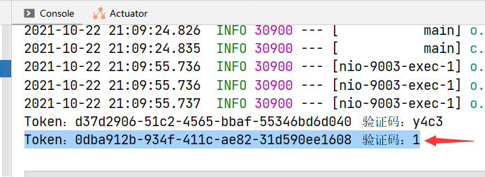

# Spring Boot组件集成实战之：集成Kaptcha谷歌验证码


[TOC]

## 1. 验证码的作用

**一个技术的出现，必然有它的道理。**

关于验证码的定义，维基百科是这样解释的：

>   **全自动区分计算机和人类的公开**（英语：**C**ompletely **A**utomated **P**ublic **T**uring test to tell **C**omputers and **H**umans **A**part，简称**CAPTCHA**），又称**验证码**，是一种区分用户是**机器**或**人类**的公共全自动程序。

所以，通过其定义，即可得出其主要功能是帮助计算机判断当前的用户是机器还是人类，从而防止有人利用计算机程序对网站进行一些破坏性操作，比如留言板大量张贴广告等。

目前常用的验证码主要有`图片验证码`、`声音验证码`、`滑块验证码`等。

本文主要基于`Kaptcha`组件，实现两种常用的图片验证码：`文本验证码`和`算式验证码`。


## 2. Spring Boot集成Kaptcha

**注意：请详细阅读代码的注释！建议结合文末的本文源码阅读~**

### 2.1 引入依赖

1、新建一个`Spring Boot`项目，结构如下图所示。


2、在`pom.xml`中，引入`kaptcha`和`hutool`依赖，如下。

```xml
<!-- hutool工具类 -->
<dependency>
    <groupId>cn.hutool</groupId>
    <artifactId>hutool-all</artifactId>
    <version>5.7.12</version>
</dependency>
<!-- 图片验证码 -->
<dependency>
    <groupId>com.github.penggle</groupId>
    <artifactId>kaptcha</artifactId>
    <version>2.3.2</version>
</dependency>
```

>   **这里为什么也引入hutool组件？**
>
>   因为hutool组件也集成了验证码功能，所以这个项目中一并进行演示。

### 2.2 配置Kaptcha配置类

上图中我们已经给出了项目的架构，`com.cxhit.captcha` 包下，包含`config`、`controller`、`entity`、`service`、`utils` 5个包。

3、在`utils`包下，新建一个名为`MyCaptchaUtil`的`java class` ，是一个工具类。

该类中的方法主要是生成**数学类型的文本算式**验证码，如`1+1=？`类型的验证码。

该工具类的完整源码如下。

```java
package com.cxhit.captcha.utils;

import java.security.SecureRandom;
import java.util.HashMap;
import java.util.Map;
import java.util.Random;

/**
 * 自定义的验证码工具类
 *
 * @author 拾年之璐
 * @since 2021-10-04 0004 20:54
 */
public class MyCaptchaUtil {

    /**
     * 生成数学文本算式
     *
     * @param a 数字
     * @param b 数字
     * @return 字符
     */
    public static Map<String, String> mathTextCreator(int a, int b) {
        Random random = new SecureRandom();
        // 生成随机操作，操作范围：[0,4)，分别表示： +  -  *  /
        int op = random.nextInt(4);
        // 定义计算的结果
        Integer result = 0;
        // 定义构建的算式字符串
        StringBuilder resultString = new StringBuilder();
        // 运算符：-
        if (1 == op) {
            if (a >= b) {
                result = a - b;
                resultString.append(a).append("-").append(b).append("=?@").append(result);
            } else {
                result = b - a;
                resultString.append(b).append("-").append(a).append("=?@").append(result);
            }
        }
        // 运算符：*
        else if (2 == op) {
            result = a * b;
            resultString.append(a).append("*").append(b).append("=?@").append(result);
        }
        // 运算符：/
        else if (3 == op) {
            if (a != 0 && b % a == 0) {
                result = b / a;
                resultString.append(b).append("/").append(a).append("=?@").append(result);
            } else if (b != 0 && a % b == 0) {
                result = a / b;
                resultString.append(a).append("/").append(b).append("=?@").append(result);
            } else {
                return mathTextCreator(a, b);
            }
        }
        // 运算符：+
        else {
            result = b + a;
            resultString.append(a).append("+").append(b).append("=?@").append(result);
        }
        Map<String, String> ret = new HashMap<String, String>();
        ret.put("resultCode", result.toString());
        ret.put("resultString", resultString.toString());
        return ret;
    }
}
```

4、在`config`包下，新建两个类：`KaptchaMathOneTextCreator`和`KaptchaMathTwoTextCreator`，并均继承自`DefaultTextCreator`。

这两个方法的主要作用是生成**一位数**和**两位数**的`加减乘除`算式验证码。

**KaptchaMathOneTextCreator.java 源码如下。**

```java
package com.cxhit.captcha.config;

import com.cxhit.captcha.utils.MyCaptchaUtil;
import com.google.code.kaptcha.text.impl.DefaultTextCreator;

import java.security.SecureRandom;
import java.util.Map;
import java.util.Random;

/**
 * 验证码随机文本生成器之：一位数的加减乘除
 *
 * @author 拾年之璐
 * @since 2021-10-04 0004 20:24
 */
public class KaptchaMathOneTextCreator extends DefaultTextCreator {

    @Override
    public String getText() {
        Random random = new SecureRandom();
        // 生成两个随机数，随机数范围：[0,10)，并返回结果
        Map<String, String> result = MyCaptchaUtil.mathTextCreator(random.nextInt(10), random.nextInt(10));
        return result.get("resultString");
    }
}
```

**KaptchaMathTwoTextCreator.java 源码如下。**

```java
package com.cxhit.captcha.config;

import com.cxhit.captcha.utils.MyCaptchaUtil;
import com.google.code.kaptcha.text.impl.DefaultTextCreator;

import java.security.SecureRandom;
import java.util.Map;
import java.util.Random;

/**
 * 验证码随机文本生成器之：两位数的加减乘除
 *
 * @author 拾年之璐
 * @since 2021-10-04 0004 20:26
 */
public class KaptchaMathTwoTextCreator extends DefaultTextCreator {

    @Override
    public String getText() {
        Random random = new SecureRandom();
        // 保存计算结果
        Map<String, String> result = MyCaptchaUtil.mathTextCreator(random.nextInt(100), random.nextInt(100));
        // 生成两个随机数，随机数范围：[0,100)，并返回结果
        return result.get("resultString");
    }
}
```

5、在`config`包下，新建名为`KaptchaConfig`的`java class`，写入如下配置信息，配置的详情见代码注释。

```java
package com.cxhit.captcha.config;

import com.google.code.kaptcha.impl.DefaultKaptcha;
import com.google.code.kaptcha.util.Config;
import org.springframework.context.annotation.Bean;
import org.springframework.context.annotation.Configuration;

import java.util.Properties;

import static com.google.code.kaptcha.Constants.*;

/**
 * Google验证码配置类
 *
 * @author 拾年之璐
 * @since 2021-10-04 0004 20:12
 */
@Configuration
public class KaptchaConfig {

    /**
     * 验证码配置默认配置
     *
     * @return 配置信息
     */
    @Bean(name = "captchaProducer")
    public DefaultKaptcha getKaptchaBean() {
        DefaultKaptcha defaultKaptcha = new DefaultKaptcha();
        Properties properties = new Properties();
        // 是否有边框。默认true，可选：yes，no
        properties.setProperty(KAPTCHA_BORDER, "yes");
        // 验证码文本字符颜色。默认Color.BLACK
        properties.setProperty(KAPTCHA_TEXTPRODUCER_FONT_COLOR, "black");
        // 验证码图片宽度。默认200
        properties.setProperty(KAPTCHA_IMAGE_WIDTH, "160");
        // 验证码图片高度。默认50
        properties.setProperty(KAPTCHA_IMAGE_HEIGHT, "60");
        // 验证码文本字符大小。默认40
        properties.setProperty(KAPTCHA_TEXTPRODUCER_FONT_SIZE, "38");
        // KAPTCHA_SESSION_KEY
        properties.setProperty(KAPTCHA_SESSION_CONFIG_KEY, "kaptchaCode");
        // 验证码文本字符长度。默认5
        properties.setProperty(KAPTCHA_TEXTPRODUCER_CHAR_LENGTH, "4");
        // 验证码文本字体样式。默认：new Font("Arial", 1, fontSize), new Font("Courier", 1, fontSize)
        properties.setProperty(KAPTCHA_TEXTPRODUCER_FONT_NAMES, "Arial,Courier");
        // 图片样式。
        // 水纹：com.google.code.kaptcha.impl.WaterRipple
        // 鱼眼：com.google.code.kaptcha.impl.FishEyeGimpy
        // 阴影：com.google.code.kaptcha.impl.ShadowGimpy
        properties.setProperty(KAPTCHA_OBSCURIFICATOR_IMPL, "com.google.code.kaptcha.impl.ShadowGimpy");
        Config config = new Config(properties);
        defaultKaptcha.setConfig(config);
        return defaultKaptcha;
    }

    /**
     * 验证码数学题类配置（一位数加减乘除）
     *
     * @return 配置信息
     */
    @Bean(name = "captchaProducerMathOne")
    public DefaultKaptcha getKaptchaBeanMathOne() {
        DefaultKaptcha defaultKaptcha = new DefaultKaptcha();
        Properties properties = commonConfig("com.cxhit.captcha.config.KaptchaMathOneTextCreator");
        Config config = new Config(properties);
        defaultKaptcha.setConfig(config);
        return defaultKaptcha;
    }

    /**
     * 验证码数学题类配置（两位数的加减乘除）
     *
     * @return 配置信息
     */
    @Bean(name = "captchaProducerMathTwo")
    public DefaultKaptcha getKaptchaBeanMathTwo() {
        DefaultKaptcha defaultKaptcha = new DefaultKaptcha();
        Properties properties = commonConfig("com.cxhit.captcha.config.KaptchaMathTwoTextCreator");
        Config config = new Config(properties);
        defaultKaptcha.setConfig(config);
        return defaultKaptcha;
    }

    /**
     * 算式运算配置的公共配置类
     *
     * @param textImpl 验证码文本生成器
     * @return 配置类
     */
    protected static Properties commonConfig(String textImpl) {
        Properties properties = new Properties();
        // 是否有边框。默认为true，可设置：yes，no
        properties.setProperty(KAPTCHA_BORDER, "yes");
        // 边框颜色。默认：Color.BLACK
        properties.setProperty(KAPTCHA_BORDER_COLOR, "105,179,90");
        // 验证码文本字符颜色。默认：Color.BLACK
        properties.setProperty(KAPTCHA_TEXTPRODUCER_FONT_COLOR, "blue");
        // 验证码图片宽度。默认：200
        properties.setProperty(KAPTCHA_IMAGE_WIDTH, "160");
        // 验证码图片高度。默认：50
        properties.setProperty(KAPTCHA_IMAGE_HEIGHT, "60");
        // 验证码文本字符大小。默认：40
        properties.setProperty(KAPTCHA_TEXTPRODUCER_FONT_SIZE, "35");
        // KAPTCHA_SESSION_KEY
        properties.setProperty(KAPTCHA_SESSION_CONFIG_KEY, "kaptchaCodeMath");
        // 验证码文本生成器
        properties.setProperty(KAPTCHA_TEXTPRODUCER_IMPL, textImpl);
        // 验证码文本字符间距。默认：2
        properties.setProperty(KAPTCHA_TEXTPRODUCER_CHAR_SPACE, "3");
        // 验证码文本字符长度。默认：5
        properties.setProperty(KAPTCHA_TEXTPRODUCER_CHAR_LENGTH, "6");
        // 验证码文本字体样式。默认：new Font("Arial", 1, fontSize), new Font("Courier", 1, fontSize)
        properties.setProperty(KAPTCHA_TEXTPRODUCER_FONT_NAMES, "Arial,Courier");
        // 验证码噪点颜色。默认：Color.BLACK
        properties.setProperty(KAPTCHA_NOISE_COLOR, "white");
        // 干扰实现类
        properties.setProperty(KAPTCHA_NOISE_IMPL, "com.google.code.kaptcha.impl.NoNoise");
        // 图片样式。
        // 水纹：com.google.code.kaptcha.impl.WaterRipple
        // 鱼眼：com.google.code.kaptcha.impl.FishEyeGimpy
        // 阴影：com.google.code.kaptcha.impl.ShadowGimpy
        properties.setProperty(KAPTCHA_OBSCURIFICATOR_IMPL, "com.google.code.kaptcha.impl.ShadowGimpy");
        // 返回生成的配置类
        return properties;
    }
}
```

该配置文件主要是配置了三种类型的验证码生成器：

+   简单文本验证码
+   一位数加减乘除算式验证码
+   两位数加减乘除算式验证码

至此，完成的配置文件如下图所示。


### 2.3 实现验证码服务层接口

6、在`entity`包下，新建名为`CaptchaDomain`的`实体`，用来进行验证码的数据传输。

其详细源码如下所示。

```java
package com.cxhit.captcha.entity;

import com.fasterxml.jackson.annotation.JsonIgnore;
import com.fasterxml.jackson.annotation.JsonInclude;

import java.awt.image.BufferedImage;
import java.io.Serializable;

/**
 * 第三方验证码实体类
 *
 * @author 拾年之璐
 * @since 2021-10-04 0004 20:02
 */
@JsonInclude(JsonInclude.Include.NON_NULL)
public class CaptchaDomain implements Serializable {

    private static final long serialVersionUID = 1L;

    /**
     * 验证码的Token
     */
    private String token;

    /**
     * 验证码的字符。返回的JSON，禁止返回给前端。
     */
    @JsonIgnore
    private String text;

    /**
     * 验证码的验证字符。比如算式的结果等。
     */
    @JsonIgnore
    private String code;

    /**
     * 验证码缓冲图像
     */
    @JsonIgnore
    private BufferedImage image;

    /**
     * 验证码图片的Base64字符串
     */
    private String base64;

    public String getToken() {
        return token;
    }

    public void setToken(String token) {
        this.token = token;
    }

    public String getText() {
        return text;
    }

    public void setText(String text) {
        this.text = text;
    }

    public String getCode() {
        return code;
    }

    public void setCode(String code) {
        this.code = code;
    }

    public BufferedImage getImage() {
        return image;
    }

    public void setImage(BufferedImage image) {
        this.image = image;
    }

    public String getBase64() {
        return base64;
    }

    public void setBase64(String base64) {
        this.base64 = base64;
    }

    @Override
    public String toString() {
        return "CaptchaDomain{" +
                "token='" + token + '\'' +
                ", text='" + text + '\'' +
                ", code='" + code + '\'' +
                ", image=" + image +
                ", base64='" + base64 + '\'' +
                '}';
    }
}
```

7、在`service`包下，新建名为`ICaptchaService`的服务层接口。详细源码如下。

```java
package com.cxhit.captcha.service;

import com.cxhit.captcha.entity.CaptchaDomain;

/**
 * <p>
 * 验证码服务接口
 * </p>
 *
 * @author 拾年之璐
 * @since 2021-10-06 0006 19:47
 */
public interface ICaptchaService {

    /**
     * Kaptcha生成验证码实体的服务层接口
     *
     * @param type 类型，char - 字符(缺省) | math - 一位数算式 | math2 - 两位数算式
     * @return 验证码实体
     */
    public CaptchaDomain createGoogleCaptcha(String type);


    /**
     * Hutool生成验证码实体的服务层接口
     *
     * @param width  验证码图片的宽度
     * @param height 验证码图片的高度
     * @return 验证码实体
     */
    public CaptchaDomain createHutoolCaptcha(Integer width, Integer height);
}
```

>   只有在`服务层接口`中，我们才集成了`hutool`的验证码功能。所以说，hutool的验证码生成似乎更简单。

8、在`service.impl`包下，新建名为`ICaptchaServiceImpl`的类，并**实现ICaptchaService的接口**。详细源码如下。

```java
package com.cxhit.captcha.service.impl;

import cn.hutool.captcha.AbstractCaptcha;
import cn.hutool.captcha.CaptchaUtil;
import com.cxhit.captcha.entity.CaptchaDomain;
import com.cxhit.captcha.service.ICaptchaService;
import com.google.code.kaptcha.Producer;
import org.springframework.stereotype.Service;
import sun.misc.BASE64Encoder;

import javax.annotation.Resource;
import javax.imageio.ImageIO;
import java.io.ByteArrayOutputStream;
import java.security.SecureRandom;
import java.util.Random;
import java.util.UUID;

/**
 * 验证码服务接口的实现
 *
 * @author 拾年之璐
 * @since 2021-10-06 0006 19:47
 */
@Service
public class ICaptchaServiceImpl implements ICaptchaService {

    @Resource(name = "captchaProducer")
    private Producer captchaProducer;

    @Resource(name = "captchaProducerMathOne")
    private Producer captchaProducerMathOne;

    @Resource(name = "captchaProducerMathTwo")
    private Producer captchaProducerMathTwo;

    private static final String TYPE_CHAR = "char";
    private static final String TYPE_MATH_ONE = "math";
    private static final String TYPE_MATH_TWO = "math2";

    /**
     * Kaptcha生成验证码实体
     *
     * @param type 类型，char - 字符(缺省) | math - 一位数算式 | math2 - 两位数算式
     * @return 验证码实体
     */
    @Override
    public CaptchaDomain createGoogleCaptcha(String type) {
        // 定义验证码实体
        CaptchaDomain captchaDomain = new CaptchaDomain();
        // 一位数加减乘除
        if (TYPE_MATH_ONE.equals(type)) {
            // 生成文本
            String producerText = captchaProducerMathOne.createText();
            // 设置验证码字符
            captchaDomain.setText(producerText.substring(0, producerText.indexOf("@")));
            // 设置验证码答案码
            captchaDomain.setCode(producerText.substring(producerText.indexOf("@") + 1));
            // 设置验证码图片
            captchaDomain.setImage(captchaProducerMathOne.createImage(captchaDomain.getText()));
        }
        // 两位数加减乘除
        else if (TYPE_MATH_TWO.equals(type)) {
            String producerText = captchaProducerMathTwo.createText();
            captchaDomain.setText(producerText.substring(0, producerText.indexOf("@")));
            captchaDomain.setCode(producerText.substring(producerText.indexOf("@") + 1));
            captchaDomain.setImage(captchaProducerMathTwo.createImage(captchaDomain.getText()));
        }
        // 缺省情况：字符
        else {
            captchaDomain.setText(captchaProducer.createText());
            captchaDomain.setCode(captchaDomain.getText());
            captchaDomain.setImage(captchaProducer.createImage(captchaDomain.getText()));
        }
        // 生成base64
        try {
            // 定义字节数组输出流
            ByteArrayOutputStream outputStream = new ByteArrayOutputStream();
            // 将图像以 jpg 的形式，写到字节数组输出流中
            ImageIO.write(captchaDomain.getImage(), "jpg", outputStream);
            // 对字节数组Base64编码
            BASE64Encoder encoder = new BASE64Encoder();
            // 写入base64格式
            captchaDomain.setBase64("data:image/jpg;base64," + encoder.encode(outputStream.toByteArray()));
            // 写入唯一Token
            captchaDomain.setToken(UUID.randomUUID().toString());
            // 返回结果
            return captchaDomain;
        } catch (Exception e) {
            System.out.println(e.getMessage());
            return null;
        }
    }

    @Override
    public CaptchaDomain createHutoolCaptcha(Integer width, Integer height) {
        CaptchaDomain captchaDomain = new CaptchaDomain();
        // 生成 0、1、2 三个整数其一，随机对应下面的三种验证码类型
        // 注意：这里只是尽可能多的展示每种验证码的使用方法，实际项目中选择一种即可。
        Random random = new SecureRandom();
        int type = random.nextInt(3);
        AbstractCaptcha captcha = null;
        // 【0】生成 线段干扰验证码
        if (type == 0) {
            //定义图形验证码的长和宽
            captcha = CaptchaUtil.createLineCaptcha(width, height);
        }
        // 【1】生成 圆圈干扰验证码
        else if (type == 1) {
            //定义图形验证码的长、宽。还可以设置两个参数：验证码字符数、干扰元素个数
            captcha = CaptchaUtil.createCircleCaptcha(width, height);
        }
        // 【2】生成 扭曲干扰验证码
        else {
            captcha = CaptchaUtil.createShearCaptcha(width, height);
        }
        // 信息配置
        captchaDomain.setText(captcha.getCode());
        captchaDomain.setCode(captcha.getCode());
        captchaDomain.setBase64(captcha.getImageBase64Data());
        captchaDomain.setImage(captcha.getImage());
        captchaDomain.setToken(UUID.randomUUID().toString());

        return captchaDomain;
    }
}
```

至此，我们已经在项目中完成了验证码的集成工作。

截止当前，完成的文件如下图所示。


## 3. 验证码的生成与使用

我们先分析一下验证码在不同框架中的使用流程。

+   **前后端不分离：**

这种框架下，可以使用`session`、`Redis`、`MySQL`等存储验证码。

每个会话的属性等配置信息，均以`Session`存储在服务端内存中，可以使用`Session ID`（会话的Key）对访问用户的身份进行判断和区分。

+   **前后端分离：**

这种框架下，一般使用`Redis`、`MySQL`等存储验证码，使用`Token+验证码`的形式，来对访问用户身份进行判断和区分。

其实现方案就是后端生成验证码的同时，为该验证码生成一个唯一的Token。将验证码图片和Token返回给前端，验证码答案和Token存储在数据库中，并设置过期时间。前端用户提交验证码的同时，也将Token一起提交给后端，Token负责架起用户输入的验证码和正确验证码之间的桥梁。

**所以，在接下来的控制类接口中，我们将模拟这两种场景。**

>    **代码的逻辑，请见代码注释！**

`CaptchaController`的完整源码如下。

```java
package com.cxhit.captcha.controller;


import com.cxhit.captcha.entity.CaptchaDomain;
import com.cxhit.captcha.service.ICaptchaService;
import org.springframework.beans.factory.annotation.Autowired;
import org.springframework.stereotype.Controller;
import org.springframework.web.bind.annotation.GetMapping;
import org.springframework.web.bind.annotation.RequestMapping;
import org.springframework.web.bind.annotation.RequestParam;
import org.springframework.web.bind.annotation.ResponseBody;

import javax.annotation.Resource;
import javax.imageio.ImageIO;
import javax.servlet.ServletOutputStream;
import javax.servlet.http.HttpServletRequest;
import javax.servlet.http.HttpServletResponse;
import javax.servlet.http.HttpSession;
import java.io.IOException;
import java.security.SecureRandom;
import java.util.Random;

/**
 * 生成验证码接口
 *
 * @author 拾年之璐
 * @since 2021-10-04 0004 21:16
 */
@Controller
@RequestMapping("/")
public class CaptchaController {

    @Autowired
    private ICaptchaService captchaService;

    @Resource
    protected HttpServletRequest request;
    @Resource
    protected HttpServletResponse response;

    /**
     * 测试的主页
     *
     * @return 访问 localhost:9003 ，即可访问主页
     */
    @GetMapping("")
    @ResponseBody
    public String index() {
        return "<html>\n" +
                "\n" +
                "<head>\n" +
                "<title>验证码生成</title>\n" +
                "</head>\n" +
                "\n" +
                "<body>\n" +
                "<p>获取验证码实体：<a href=\"/captcha/get\" target=_blank>localhost:9003/captcha/get</a> （链接缺省type参数，默认生成文本验证码）<br></p>\n" +
                "<p>获取验证码实体：<a href=\"/captcha/get?type=math\" target=_blank>localhost:9003/captcha/get?type=math</a><br></p>\n" +
                "<p>获取验证码实体：<a href=\"/captcha/get?type=math2\" target=_blank>localhost:9003/captcha/get?type=math2</a><br></p>\n" +
                "<p>获取验证码图片：<a href=\"/captcha/get/image?type=math\" target=_blank>localhost:9003/captcha/get/image?type=math</a> （此接口包含hutool验证码的测试）<br></p>\n" +
                "<p>链接末尾可加的type参数有：char、math、math2" +
                "</body>\n" +
                "\n" +
                "</html>\n";
    }

    /**
     * 获取验证码接口
     *
     * @param type 类型，char - 字符(默认) | math - 一位数算式 | math2 - 两位数算式
     * @return 返回验证码Token+验证码图片的Base64值
     */
    @GetMapping("/captcha/get")
    @ResponseBody
    public CaptchaDomain getCaptcha(@RequestParam(value = "type", required = false, defaultValue = "char") String type) {
        // 生成验证码实体
        CaptchaDomain captchaDomain = captchaService.createGoogleCaptcha(type);
        if (null != captchaDomain) {
            // 将验证码保存至redis
            // redisUtils.set(captchaDomain.getToken(), captchaDomain.getCode(), 300L);
            // 判断验证码正确
            // if (null != redisUtils.get(captchaToken) && redisUtils.get(captchaToken).toString().equals(captcha)) {
            //     System.out.println("验证码正确！继续执行验证码正确后的操作");
            // }
            // 打印测试
            System.out.println("Token：" + captchaDomain.getToken() + "\t验证码：" + captchaDomain.getCode());
            // 无用信息设空
            captchaDomain.setText(null);
            captchaDomain.setCode(null);
            // 返回前端信息
            return captchaDomain;
        } else {
            return null;
        }

    }

    /**
     * 直接输出图片
     *
     * @param type 类型，char - 字符(默认) | math - 一位数算式 | math2 - 两位数算式
     */
    @GetMapping("/captcha/get/image")
    public void getCaptchaImage(@RequestParam(value = "type", required = false, defaultValue = "char") String type) {
        CaptchaDomain captchaDomain = null;
        // 此处生成0或1的随机数，以随机测试谷歌验证码和hutool验证码
        Random random = new SecureRandom();
        int rand = random.nextInt(2);
        if (rand == 0) {
            // 生成谷歌验证码实体
            captchaDomain = captchaService.createGoogleCaptcha(type);
        } else {
            // 生成hutool验证码实体
            captchaDomain = captchaService.createHutoolCaptcha(160, 60);
        }
        // 打印验证码
        System.out.println("Token：" + captchaDomain.getToken() + "\t验证码：" + captchaDomain.getCode());
        // 保存至session
        HttpSession session = request.getSession();
        session.setAttribute(captchaDomain.getToken(), captchaDomain.getCode());
        // 从session中读取测试测试
        System.out.println("根据Token:" + captchaDomain.getToken() + "，从session中读取验证码：" + session.getAttribute(captchaDomain.getToken()));
        // 以文件流的形式，输出验证码图片
        ServletOutputStream out = null;
        try {
            response.setContentType("image/jpeg");
            out = response.getOutputStream();
            ImageIO.write(captchaDomain.getImage(), "jpg", out);
            out.flush();
        } catch (Exception e) {
            e.printStackTrace();
        } finally {
            try {
                if (out != null) {
                    out.close();
                }
            } catch (IOException e) {
                e.printStackTrace();
            }

        }
    }

}
```

启动项目，访问 [localhost:9003]() （这里的端口在application.yml里配置），如下图所示。


访问`前三个`链接，返回的数据格式如下图所示。


将`base64`的值，复制到`浏览器`的`新建标签页`中，即可查看生成的验证码图片。如下图所示。


>   主要前后不要加引号。

后台可以看到打印的测试内容。如下图所示。



直接访问`第四个链接`，可以直接生成图片验证码，如下图所示。


后台同样可以看到打印的测试内容，如下图所示。


至此，关于验证码的全部功能，测试完毕。

## 4. 本文源码下载
+   [https://github.com/cxh1231/SpringBoot-Study](https://github.com/cxh1231/SpringBoot-Study)
+   [https://gitee.com/cxh1231/SpringBoot-Study](https://gitee.com/cxh1231/SpringBoot-Study)

