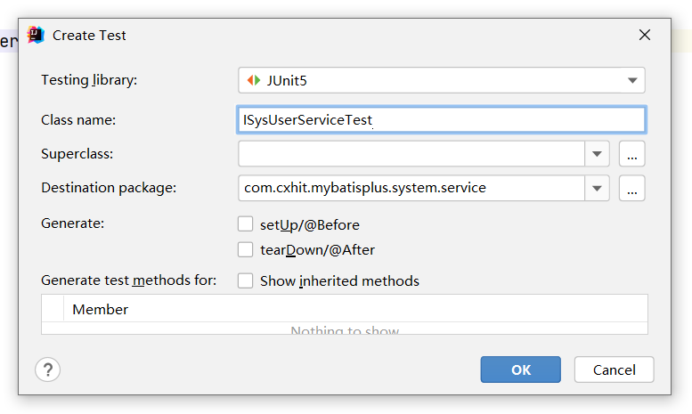

#  Spring Boot组件集成专栏之：集成MyBatis-Plus（含代码生成器）

[TOC]

## 1. MyBatis-Plus产生的原因

**一个技术的出现，必然有它的道理。**

提起基于Web的项目框架，都会想到`SSM`，是由`Spring+MyBatis`框架整合而成的原始Web项目框架。

其中的`MyBatis`是一种操作数据库的框架，使用`XML`描述符或注释，将对象与存储过程或`SQL`语句耦合，将关系型数据库与面向对象应用程序结合使用变得更加容易。其支持定制化`SQL`、存储过程，以及高级映射。

而`MyBatis`本身存在些许不足，比如配置文件繁多，以及当编写一个业务逻辑时，需要在Dao层写一个方法，再写一个与之对应的SQL语句。

所以，针对这些不足，一个`MyBatis`的增强工具，`MyBatis-Plus`就产生了。

>   当然，`MyBatis`的增强工具，除了`MyBatis-Plus`，还有`TK.Mybatis`等。

## 2. MyBatis-Plus解决的问题

在`MyBatis-Plus`官网，是这样介绍MP的：

>   `MyBatis-Plus`是一个 `MyBatis` 的增强工具，在 `MyBatis` 的基础上只做增强不做改变，为简化开发、提高效率而生。
>
>   MP官网：https://mp.baomidou.com

`MyBatis-Plus`的简称是 `MP`，后文中，我们可能会过多使用此简称。

`MP`除了解决`MyBatis`的些许不足外，还具有如下特性。


接下来，详细讲述如何在`Spring Boot`项目中集成`MP`。

## 3. Spring Boot集成Druid

>   Druid 是阿里巴巴开源平台上的一个项目，整个项目由数据库连接池、插件框架和 SQL 解析器组成。该项目主要是为了扩展 JDBC 的一些限制，可以让程序员实现一些特殊的需求，比如向密钥服务请求凭证、统计 SQL 信息、SQL 性能收集、SQL 注入检查、SQL 翻译等，程序员可以通过定制来实现自己需要的功能。
>
>   Druid 是目前最好的数据库连接池，在功能、性能、扩展性方面，都超过其他数据库连接池，包括 DBCP、C3P0、BoneCP、Proxool、JBoss DataSource。Druid 已经在阿里巴巴部署了超过 600 个应用，经过多年生产环境大规模部署的严苛考验。Druid 是阿里巴巴开发的号称为监控而生的数据库连接池！

### 2.1 引入依赖

首先在 `pom.xml` 文件中引入 `druid-spring-boot-starter` 依赖：

```xml
<dependency>
    <groupId>com.alibaba</groupId>
    <artifactId>druid-spring-boot-starter</artifactId>
    <version>1.2.6</version>
</dependency>
```

>   获取`druid-spring-boot-starter`依赖的其他版本，请访问：[https://mvnrepository.com/artifact/com.alibaba/druid-spring-boot-starter](https://mvnrepository.com/artifact/com.alibaba/druid-spring-boot-starter)

然后引入数据库连接 `mysql-connector-java` 依赖：

```xml
<dependency>
    <groupId>mysql</groupId>
    <artifactId>mysql-connector-java</artifactId>
    <scope>runtime</scope>
</dependency>
```

引入结果如下图所示。


通常情况下，`增删改`依赖项后，IDEA会自动做相应的加载。

如果未加载，可手动`刷新`依赖，如下图所示。


### 2.2 配置application.yml

在 `application.yml` 文件中，增加如下配置信息。

```yaml
spring:
  datasource:
    druid:
      # 链接地址，这里需要修改自己的数据库IP和数据库名
      url: jdbc:mysql://127.0.0.1:3306/db_study_mp?useUnicode=true&characterEncoding=utf-8&useSSL=false&serverTimezone=UTC
      username: root # 数据库用户名
      password: 123456 # 数据库密码
      initial-size: 1
      min-idle: 1
      max-active: 20
      test-on-borrow: true
      # 连接驱动类名
      # MySQL 8.x: com.mysql.cj.jdbc.Driver
      # MySQL 5.x: com.mysql.jdbc.Driver
      driver-class-name: com.mysql.cj.jdbc.Driver
```

这里需要注意：

+   如果`MySQL`的版本是`8.X`，`连接URL`中需要追加：`serverTimezone=UTC` 来设置时区，否则报错。

+   不同版本的数据库，连接类名`driver-class-name`也不同，均在上述源码中体现。

配置结果如下图所示。


至此，项目已经集成了`Druid`。

## 4. Spring Boot集成MyBatis-Plus

### 4.1 引入依赖

在 `pom.xml` 文件中引入 `mybatis-plus-boot-starter` 依赖，这是MP的核心依赖。

```xml
<dependency>
    <groupId>com.baomidou</groupId>
    <artifactId>mybatis-plus-boot-starter</artifactId>
    <version>3.4.3.2</version>
</dependency>
```

>   获取`mybatis-plus-boot-starter` 依赖的其他版本，请访问：[https://mvnrepository.com/artifact/com.baomidou/mybatis-plus-boot-starter](https://mvnrepository.com/artifact/com.baomidou/mybatis-plus-boot-starter)

### 4.2 配置application.yml

在 `application.yml` 文件中，增加如下配置信息。

```yaml
# Mybatis Plus 相关配置
mybatis-plus:
  # 配置Mapper映射文件
  mapper-locations: classpath*:/mapper/**/**Mapper.xml
  # 实体扫描，多个package用逗号或者分号分隔
  typeAliasesPackage: com.cxhit.mybatisplus.system.entity;
  configuration:
    # 自动驼峰命名
    map-underscore-to-camel-case: true
    auto-mapping-behavior: full
    cache-enabled: false
    # 打印SQL
    log-impl: org.apache.ibatis.logging.stdout.StdOutImpl
  global-config:
    db-config:
      # 主键类型  0:"数据库ID自增", 1:"用户输入ID", 2:"全局唯一ID (数字类型唯一ID)", 3:"全局唯一ID UUID";
      id-type: auto
      # 驼峰下划线转换
      table-underline: true
      # 逻辑删除
      logic-delete-value: 1
      logic-not-delete-value: 0
```

此配置的详细说明，注释已经标明，这里不再赘述。

只需要注意 `typeAliasesPackage` 处，要填写系统实体的包路径。多个包下的实体，可以使用`英文分号`或`英文逗号`间隔。

关于逻辑删除，将在测试部分演示。

配置结果如下图所示。


### 4.3 配置启动器、分页插件

**1、增加包扫描路径**

首先在`启动类 ExciteCmsApplication`中增加包扫描的路径。

```java
@MapperScan({"com.cxhit.mybatisplus.system.mapper", ""})
```

如果有多个包，可以根据此格式，继续追加。

添加后的结果，如下图所示。


**2、添加分页插件配置信息**

在 `config` 包下，新建一个名为 `MybatisPlusConfig` 的 `java class` 文件，并写入如下配置信息。

```java
package com.cxhit.mybatisplus.config;

import com.baomidou.mybatisplus.annotation.DbType;
import com.baomidou.mybatisplus.extension.plugins.MybatisPlusInterceptor;
import com.baomidou.mybatisplus.extension.plugins.inner.PaginationInnerInterceptor;
import org.mybatis.spring.annotation.MapperScan;
import org.springframework.context.annotation.Bean;
import org.springframework.context.annotation.Configuration;

/**
 * <p>
 * Mybatis Plus 配置信息
 * </p>
 *
 * @author 拾年之璐
 * @since 2021-09-01 0001 18:34
 */
@Configuration
@MapperScan({"com.cxhit.mybatisplus.mapper", ""})
public class MybatisPlusConfig {

    /**
     * 分页插件配置
     *
     * @return MP拦截器
     */
    @Bean
    public MybatisPlusInterceptor mybatisPlusInterceptor() {
        MybatisPlusInterceptor interceptor = new MybatisPlusInterceptor();
        interceptor.addInnerInterceptor(new PaginationInnerInterceptor(DbType.MYSQL));
        return interceptor;
    }

}
```

如下图所示。


至此，项目已集成MP。

## 5. 集成MP代码生成器

### 5.1 引入依赖

在 `pom.xml` 文件中引入 `mybatis-plus-generator` 依赖，这是代码生成器的核心依赖。

```xml
<dependency>
    <groupId>com.baomidou</groupId>
    <artifactId>mybatis-plus-generator</artifactId>
    <version>3.4.1</version>
</dependency>
<!-- freemarker，作为代码生成器mapper文件的模板引擎使用（当然也可以使用velocity，二选一即可） -->
<dependency>
    <groupId>org.springframework.boot</groupId>
    <artifactId>spring-boot-starter-freemarker</artifactId>
</dependency>
```

>   获取`mybatis-plus-boot-starter` 依赖的其他版本，请访问：[https://mvnrepository.com/artifact/com.baomidou/mybatis-plus-generator](https://mvnrepository.com/artifact/com.baomidou/mybatis-plus-generator)
>
>   注：如果使用的`MP代码生成器`版本大于 `3.4.1` ，请前往MP官网查看其最新教程（官网教程更新于2021/10/20）。
>
>   其中增加的`freemarker`，是代码生成器生成Mapper.xml文件的模板引擎使用。

### 5.2 完善并修改生成器

在`测试文件夹`下，新建一个名为 `CodeGenerator` 的 `java class` 文件，如下图所示。


然后在项目 `CodeGenerator` 类中，写入如下代码。

```java
package com.cxhit.mybatisplus;


import com.baomidou.mybatisplus.annotation.DbType;
import com.baomidou.mybatisplus.annotation.IdType;
import com.baomidou.mybatisplus.core.exceptions.MybatisPlusException;
import com.baomidou.mybatisplus.core.toolkit.StringPool;
import com.baomidou.mybatisplus.core.toolkit.StringUtils;
import com.baomidou.mybatisplus.generator.AutoGenerator;
import com.baomidou.mybatisplus.generator.InjectionConfig;
import com.baomidou.mybatisplus.generator.config.*;
import com.baomidou.mybatisplus.generator.config.po.TableInfo;
import com.baomidou.mybatisplus.generator.config.rules.NamingStrategy;
import com.baomidou.mybatisplus.generator.engine.FreemarkerTemplateEngine;

import java.util.ArrayList;
import java.util.List;
import java.util.Scanner;

/**
 * MP 代码生成器
 *
 * @author 拾年之璐
 * @since 2021-09-01 0001 18:51
 */
public class CodeGenerator {
    /**
     * <p>
     * 读取控制台内容
     * </p>
     */
    private static String scanner(String tip) {
        Scanner scanner = new Scanner(System.in);
        StringBuilder help = new StringBuilder();
        help.append("请输入").append(tip).append("：");
        System.out.println(help.toString());
        if (scanner.hasNext()) {
            String ipt = scanner.next();
            if (StringUtils.isNotBlank(ipt)) {
                return ipt;
            }
        }
        throw new MybatisPlusException("请输入正确的" + tip + "！");
    }

    /**
     * 执行此处
     */
    public static void main(String[] args) {
        // 代码生成器
        AutoGenerator mpg = new AutoGenerator();

        // 项目根目录
        // 这里注意，追加的是本项目的模块目录。如果是单项目，此行注释掉，更换成下一行
        String projectPath = System.getProperty("user.dir") + "/study-mybatis-plus";
//        String projectPath = System.getProperty("user.dir");

        // 1. 全局配置
        GlobalConfig globalConfig = new GlobalConfig();
        globalConfig
                // TODO 代码生成的目录
                .setOutputDir(projectPath + "/src/main/java")
                .setAuthor("拾年之璐")       // TODO 修改项目作者
                .setOpen(false)             // 是否打开输出目录
                .setIdType(IdType.AUTO)     // 主键策略
                .setFileOverride(false)     // TODO 是否覆盖已有文件
                .setBaseResultMap(true)     // 是否开启 BaseResultMap（XML文件）
                .setBaseColumnList(true);   // 是否开启 baseColumnList（XML文件）
//                .setServiceName("");

        //把全局配置添加到代码生成器主类
        mpg.setGlobalConfig(globalConfig);

        // 2. 数据源配置
        DataSourceConfig dsConfig = new DataSourceConfig();
        dsConfig
                // 数据库链接URL
                .setUrl("jdbc:mysql://localhost:3306/db_study_mp?useUnicode=true&serverTimezone=UTC&useSSL=false&characterEncoding=utf8")
                // .setSchemaName("public")     //数据库 schema name
                .setDbType(DbType.MYSQL)        // 数据库类型
                // 数据库驱动，MySQL5.X：com.mysql.jdbc.Driver
                .setDriverName("com.mysql.cj.jdbc.Driver")
                .setUsername("chen")            // TODO 数据库用户名
                .setPassword("123456");         // TODO 数据库密码

        // 把数据源配置添加到代码生成器主类
        mpg.setDataSource(dsConfig);

        // 3. 包配置
        PackageConfig pkConfig = new PackageConfig();
        // 添加这个后 会以一个实体为一个模块 比如user实体会生成user模块 每个模块下都会生成三层
        pkConfig.setModuleName(scanner("模块名（系统端建议system，客户端建议client）"));
        // TODO 父包名。如果为空，将下面子包名必须写写完整的包路径。如果不为空，只需写子包名。
        pkConfig.setParent("com.cxhit.mybatisplus")
                // TODO 子包名
                .setEntity("entity")                // 实体类 Entity包名
                .setXml("mapper")                   // 持久层 Mapper.xml 包名
                .setMapper("mapper")                // 持久层 Mapper.java 包名
                .setService("service")              // 服务层 Service.java 包名
                .setServiceImpl("service.impl")     // 服务层 ServiceImpl.java 包名
                .setController("controller");       // 控制层 Controller.java 包名

        // 把包配置添加到代码生成器主类
        mpg.setPackageInfo(pkConfig);

        // 4. 自定义配置【这是MyBatisPlus 3.x 新增的】
        InjectionConfig cfg = new InjectionConfig() {
            @Override
            public void initMap() {
                // to do nothing
            }
        };
        // 如果模板引擎是 freemarker
        String templatePath = "/templates/mapper.xml.ftl";
        // 如果模板引擎是 velocity
        // String templatePath = "/templates/mapper.xml.vm";

        // 自定义输出配置
        List<FileOutConfig> focList = new ArrayList<>();
        // 自定义配置会被优先输出
        focList.add(new FileOutConfig(templatePath) {
            @Override
            public String outputFile(TableInfo tableInfo) {
                // 自定义输出文件名称，如果你 Entity 设置了前后缀、此处注意 xml 的名称会跟着发生变化！！
                return projectPath + "/src/main/resources/mapper/" + pkConfig.getModuleName()
                        + "/" + tableInfo.getEntityName() + "Mapper" + StringPool.DOT_XML;
            }
        });
        cfg.setFileOutConfigList(focList);
        mpg.setCfg(cfg);
        // 配置模板
        TemplateConfig templateConfig = new TemplateConfig();
        templateConfig.setXml(null);
        mpg.setTemplate(templateConfig);

        // 5. 策略配置(数据库表配置)
        StrategyConfig strategyConfig = new StrategyConfig();

        strategyConfig
                .setNaming(NamingStrategy.underline_to_camel)           // 数据库表映射到实体的命名策略:下划线转驼峰
                .setColumnNaming(NamingStrategy.underline_to_camel)     // 数据库表字段映射到实体的命名策略:下划线转驼峰
                .setEntityLombokModel(false)                             // 实体是否为lombok模型（默认 false）
                // .setSuperEntityClass("com.zxdmy.wx.mp.wechat.common.BaseEntity")                 // 设置实体类的父类（如果启用，实体类会增加BaseEntity的继承）
                // .setSuperControllerClass("com.zxdmy.wx.mp.wechat.common.BaseController")         // 设置控制类的父类（如果启用，控制类会增加BaseController的继承）
                // 提示输入生成的表名
                .setInclude(scanner("表全名，多个英文名称，使用英文逗号间隔").split(","))
                // .setExclude("***")                                   // 需要排除的表名，允许正则表达式
                // .setSuperEntityColumns("id");                        // 实体类主键名称设置（如果启用，生成的实体类没有此字段）
                // .setTablePrefix(pc.getModuleName() + "_")            // 表前缀符（如果启用，生成的所有文件名没有此前缀）
                .setControllerMappingHyphenStyle(true);                 // 驼峰转连字符

        // 把数据库配置添加到代码生成器主类
        mpg.setStrategy(strategyConfig);

        // 在代码生成器主类上配置模板引擎,选择 freemarker 引擎需要指定如下加，注意 pom 依赖必须有！
        mpg.setTemplateEngine(new FreemarkerTemplateEngine());
        // 开始执行
        mpg.execute();
    }
}
```

>   如果报错，请检查导入的`包`是否一致。

代码中已经给出了`详细的注释`。

你需要`仔细逐行阅读`，将需要修改的地方（比如作者、数据库名、包路径等信息），修改为自己的项目信息。

在执行`代码生成器`之前，我们在`测试数据库`中创建了一个名为`sys_user`的表单，其内容如下。


>   此数据库的SQL脚本，在文末的源代码中。

然后点击下图所示的`运行`按钮，即可执行代码生成器。


然后根据`控制台`的提示，输入相应的信息。


回车键后，即可看到生成文件的`日志信息`，如下图所示。


生成的`6个文件`详情如下图所示。


至此，项目已集成代码生成器。

>   如果项目是分模块，则可以使用上图左下角的`CodeGeneratorMultiModule`代码生成器，其有详细的配置。

## 6. 单元测试

接下来通过`测试类`，对前文集成的`数据库连接池`和`MP`进行测试。

首先进入前文创建的`ISysUserService` 服务接口类中，`光标`放置在 `ISysUserService` 接口名上，按 `Alt+Enter`，选择 `Create Test` 选项，如下图所示。


新弹窗直接点击 `OK` 即可。



这时，在`测试文件夹`下，系统为我们新建了一个`测试类`，如下图所示。


以下测试均写在此测试文件中。

### 6.1 测试基本的增删改查

我们可以从 `mapper`层或者`service`层进行测试，如下图所示。


>   如果`mapper`层提示`Could not autowire. No beans of 'SysUserMapper' type found.` ，可以通过为`mapper`接口添加 `@Repository` 注解解决此提示。
>
>   如果不添加此注解，虽然有`红线提示`，但也可以运行，请自行测试。

接下来，通过几个`测试方法`，对基本的`增删改查`进行测试。

**1、添加一条数据**

编写方法如下。

```java
/**
 * 测试添加一个用户
 */
@Test
void createOneTest() {
    SysUser user = new SysUser();
    user.setNickname("测试用户名");
    user.setEmail("10066@domain.com");
    user.setPassword("sfdnfjdsfhdsjk");
    user.setIsDelete(0);
    if (userService.save(user)) {
        System.out.println("新增用户成功");
        System.out.println(user);
    } else {
        System.out.println("新增用户失败");
    }
}
```

点击方法左侧的`执行`按钮，即可进行`测试运行`，控制台输出信息如下图所示。


**2、添加一系列数据**

编写方法如下。

```java
/**
 * 测试添加一系列数据
 */
@Test
void createListTest() {
    // 定义用户列表
    List<SysUser> userList = new ArrayList<>();
    // 随机生成 5个用户
    for (int i = 101; i <= 105; i++) {
        // 定义用户实体
        SysUser user = new SysUser();
        // 随机填充数据
        user.setNickname("用户" + i);
        user.setEmail("10" + i + "@domain.com");
        user.setPassword(DigestUtils.md5DigestAsHex(("password" + i).getBytes()));
        // 添加至列表
        userList.add(user);
    }
    // 打印用户列表
    System.out.println(userList);
    // 执行添加
    if (userService.saveBatch(userList)) {
        System.out.println("新增用户成功");
    } else {
        System.out.println("新增用户失败");
    }
}
```

执行此方法，输出结果如下图所示。


**3、修改一条数据**

我们将上图中`id`为`10018`的`用户名`修改为`李四`。

编写代码如下。

```java
/**
 * 更新一条数据
 */
@Test
void updateOneTest() {
    // 定义用户实体
    SysUser user = new SysUser();
    user.setId(10018);
    user.setNickname("李四");
    // 执行修改
    if (userService.updateById(user)) {
        System.out.println("修改用户信息成功");
    } else {
        System.out.println("修改用户信息失败");
    }
}
```

执行此方法，输出结果如下图所示。


**4、删除一条数据**

我们这里测试一下`逻辑删除`。

本文 `4.2节 配置MP的application.yml` 处，已经开启了`逻辑删除`。

首先修改 `SysUser` 实体，在 `isDelete` 字段上，增加 `@TableLogic` 注解，如下图所示。


然后编写删除的测试方法如下。

```java
/**
 * 逻辑删除测试
 */
@Test
void logicDeleteTest() {
    if (userService.removeById(10018)) {
        System.out.println("删除成功");
    } else {
        System.out.println("删除失败");
    }
}
```

执行此方法，输出结果如下图所示。


我们可以看到，其执行的是`Update`语句。

**5、查询一条数据**

前文我们删除了`ID=10018`的数据。我们执行查询该ID，测试代码如下。

```java
/**
 * 查询单个用户测试
 */
@Test
void getOneTest() {
    SysUser user = userService.getById(10018);
    if (null != user) {
        System.out.println(user);
    } else {
        System.out.println("查无此用户");
    }
}
```

执行此方法，输出结果如下图所示。


我们可以看到，其执行的SQL语句，末尾自动追加了判断条件。

### 6.2 测试分页查询

编写分页测试的代码如下。

```java
/**
 * 测试分页删除
 */
@Test
void pageTest() {
    // 进行分页查询
    Page<SysUser> userPage = userService.page(new Page<>(1, 5), null);
    // 获取查询的用户列表
    List<SysUser> userList = userPage.getRecords();
    System.out.println(userList);
    System.out.println("当前页：" + userPage.getCurrent());
    System.out.println("当前页显示条数：" + userPage.getSize());
    System.out.println("总数：" + userPage.getTotal());
}
```

执行此方法，输出结果如下图所示。


### 6.3 自定义查询

更多复杂的查询，需要使用`QueryWrapper`，其中部分示例，放在本文的项目源码中了，这里就不再赘述。


