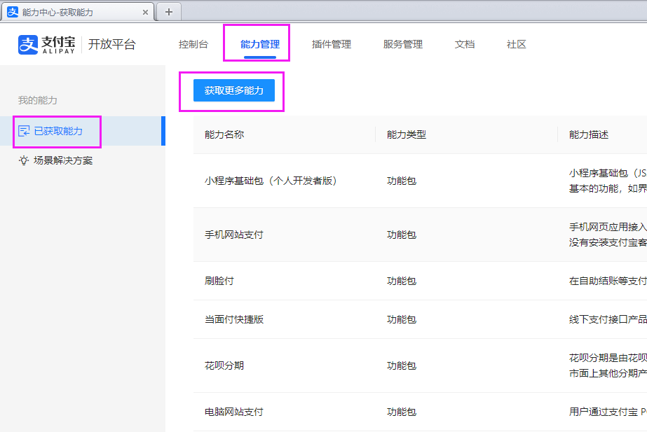
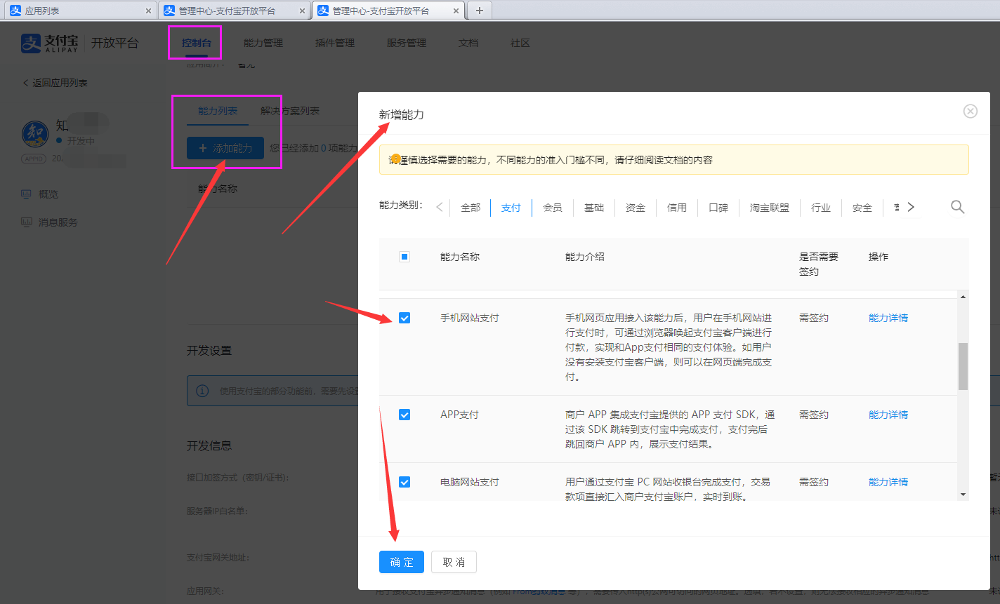
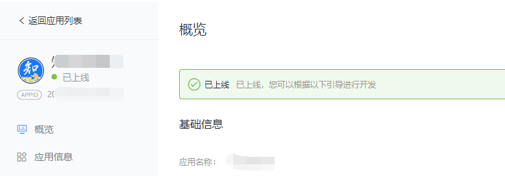

# Spring Boot组件集成实战之：集成支付宝支付

## 0. 项目演示

正式开始之前，请看本文项目的演示视频。

演示地址1：[https://www.bilibili.com/video/bv1Ab4y1H73d](https://www.bilibili.com/video/bv1Ab4y1H73d)

演示地址2：[https://live.csdn.net/v/184324](https://live.csdn.net/v/184324)

## 1. 开发环境准备

开发接入`支付宝`的项目之前，需要先在支付宝创建`应用`，并配置获取支付宝的`秘钥`、`证书`等，并为`应用`添加`能力`。

但这些`能力`，是需要在`支付宝商家中心`进行签约的，一般都要求提交`营业执照`等信息，接入门槛比较高。

如果只是开发学习，完全可以使用`沙箱环境`进行接入和开发、测试。

接下来将讲述两种开发环境的准备工作，以及必要的信息填写步骤。

### 1.1 沙箱环境

**1、进入沙箱环境**

首先访问[https://openhome.alipay.com/platform/appDaily.htm](https://openhome.alipay.com/platform/appDaily.htm) ，通过支付宝扫码登录后，即可进入沙箱环境。

默认的沙箱环境已经给初始化了一个网页应用，如下图所示。


上图中的`APPID`，是我们必须的信息之一。

**2、直接获取公钥/证书**

沙箱环境中的公钥/证书，都是默认生成的，可以直接拿来用。

往下翻，`开发信息`栏中的`接口加密方式`，有两种类型：`公钥模式`和`证书模式`，如下图所示。


关于这两种模式的区别，官网是这样解释的：

> 支付宝开放的接口中，涉及资金支出的接口需要使用到 [公钥证书](https://opendocs.alipay.com/common/02kdnc#公钥证书方式_2) 。
>
> 详情：[https://opendocs.alipay.com/common/02kg66](https://opendocs.alipay.com/common/02kg66)

所以一般来说，使用`公钥模式`就足够了。

**公钥模式：**

`公钥模式`下，需要用到的信息是`应用私钥（Java语言）`、`支付宝公钥` 2项。

**证书模式：**

`证书模式`下，需要用到的信息是 `应用公钥证书`、`应用私钥（Java语言）`、`支付宝公钥证书`、`支付宝根证书` 4项。

对于`沙箱环境`，点击上图中已经启用的各个模式后的`查看`按钮，即可看到上述所有信息。


**3、获取沙箱账号并登录沙箱APP**

访问左侧的`沙箱账号`模块，即可查看自己沙箱环境中的`各种账号信息`，如下图所示。


访问左侧的`沙箱工具`模块，可以下载`安卓`手机的`沙箱版支付宝客户端`，如下图所示。


下载该APP后，在手机登录沙箱账号中的买家账号。

### 1.2 正式环境

**1、获取能力**

正式环境下，访问`开放平台`的`能力管理`页面（[https://open.alipay.com/svr/ability/get](https://open.alipay.com/svr/ability/get)）根据自己的项目需求，添加`能力`，如下图所示。



**2、创建应用**

访问`开放平台`的`控制台`（[https://open.alipay.com/dev/workspace](https://open.alipay.com/dev/workspace)），切换至`网页&移动应用`Tab下，如下图所示。


点击`创建应用`按钮，根据要求填写信息，点击`确认创建`，即可创建一个应用。如下图所示。


**3、添加能力**

刚创建完成的应用，是没有任何功能的，需要手动添加能力。

前往`控制`台的该应用详情页，`能力列表`模块中，点击`添加能力`，勾选需要添加的功能后，点击`确定`即可。如下图所示。



添加完成后，如下图所示。


上图显示`能力`没有`关联至商户`，则根据上图提示，点击`商家中心`按钮，前往商家中心，如下图所示。


点击`添加绑定`按钮，输入新建应用的`APPID`即可绑定。

然后返回应用详情页，刷新页面，即可看到`状态`不是未关联了。


**4、设置接口加密信息**

往下翻，至`开发信息`模块，设置接口加密方式。


此阶段可以根据文档 [https://opendocs.alipay.com/common/02kipl](https://opendocs.alipay.com/common/02kipl) 的说明进行操作。

对于`公钥模式`，则非常简单。先前往官方在线加密页面（[https://miniu.alipay.com/keytool/create](https://miniu.alipay.com/keytool/create)），点击`生成`按钮，生成`私钥`和`公钥`，如下图所示。


`应用私钥`自己保存好。

`应用公钥`填写至设置`接口加密方式`页面中的`公钥`模式中的`公钥字符`输入框中即可。如下图所示。


**5、提交审核。**

翻到应用详情页的最上方，点击`提交审核`按钮即可。


审核通过的应用是这样的：



至此，开发环境准备工作结束。

## 2. 项目创建与依赖导入

### 2.1 创建Spring Boot项目

创建Spring Boot项目的教程太多太多了......比如：[https://cxhit.blog.csdn.net/article/details/113782979](https://cxhit.blog.csdn.net/article/details/113782979)，所以这里就不再赘述。

项目结构如下图所示。


### 2.2 导入依赖

在`pom.xml`文件中，引入支付宝官方的SDK依赖：

```xml
<dependency>
   <groupId>com.alipay.sdk</groupId>
   <artifactId>alipay-easysdk</artifactId>
   <version>2.2.1</version>
</dependency>
```

其中最新版本可前往Maven官方仓库查看。

## 3. 实现支付服务类

### 3.1 创建配置实体类

在`com.cxhit.pay.alipay.entity`包下，新建名为`AlipayEntity`的`实体类`，并写入如下内容。

```java
package com.cxhit.pay.alipay.entity;

import java.io.Serializable;

/**
 * 支付宝支付配置信息实体
 *
 * @author 拾年之璐
 * @since 2022/1/10 22:13
 */
@Data
public class AlipayEntity implements Serializable {

    private static final long serialVersionUID = 1L;

    /**
     * 必填：应用AppId，例如：2019091767145019
     */
    private String appId;

    /**
     * 必填：应用名称
     */
    private String appName;

    /**
     * 必填：应用私钥（Java语言），例如：MIIEvQIBADANB ... ...
     */
    private String merchantPrivateKey;

    // 接口加签方式分：证书模式（收、退款）和公钥模式（只能收款）
    // 证书模式文档：https://opendocs.alipay.com/common/02kipl
    // 优先级：证书模式 ＞ 非证书模式

    /**
     * 证书模式：【应用公钥证书】文件路径，路径优先级：文件系统 ＞ CLASS_PATH
     */
    private String merchantCertPath;

    /**
     * 证书模式：【支付宝公钥证书】文件路径，路径优先级：文件系统 ＞ CLASS_PATH
     */
    private String alipayCertPath;

    /**
     * 证书模式：【支付宝根证书】文件路径，路径优先级：文件系统 ＞ CLASS_PATH
     */
    private String alipayRootCertPath;

    /**
     * 公钥模式：只需要填写此【支付宝公钥】即可，无需赋值上面的三个证书路径
     */
    private String alipayPublicKey;

    /**
     * 可选：异步通知接收服务地址，例如：https://www.test.com/callback
     */
    private String notifyUrl;

    /**
     * 可选：AES密钥（接口内容加密方式），调用AES加解密相关接口时需要
     */
    private String encryptKey;

    /**
     * 必填：协议类型：http | https 二选一
     */
    private String protocol = "https";

    /**
     * 必填：gatewayHost，默认：openapi.alipay.com
     */
    private String gatewayHost = "openapi.alipay.com";

    /**
     * 必填：签名类型，默认RSA2
     */
    private String signType = "RSA2";
}
```

> 注意：为了减少代码篇幅，此代码引入了`lombok`。如果没有使用`lombok`，请自行生成Get和Set方法。

### 3.2 实现支付服务类

在`com.cxhit.pay.alipay.service`包下，新建名为`AlipayService`的`服务类`，并写入如下代码。

> 以下代码实现了基本的配置，以及支付、退款、查询功能，有详细的注释。
>
> 另注意：以下代码中使用了Hutool组件的Id生成工具（用于生成订单号），请在pom文件中自行添加hutool的依赖。

```java
package com.cxhit.pay.alipay.service;

import cn.hutool.core.util.IdUtil;
import com.alipay.easysdk.factory.Factory;
import com.alipay.easysdk.kernel.Config;
import com.alipay.easysdk.kernel.util.ResponseChecker;
import com.alipay.easysdk.payment.app.models.AlipayTradeAppPayResponse;
import com.alipay.easysdk.payment.common.models.AlipayDataDataserviceBillDownloadurlQueryResponse;
import com.alipay.easysdk.payment.common.models.AlipayTradeFastpayRefundQueryResponse;
import com.alipay.easysdk.payment.common.models.AlipayTradeQueryResponse;
import com.alipay.easysdk.payment.common.models.AlipayTradeRefundResponse;
import com.alipay.easysdk.payment.facetoface.models.AlipayTradePrecreateResponse;
import com.alipay.easysdk.payment.page.models.AlipayTradePagePayResponse;
import com.alipay.easysdk.payment.wap.models.AlipayTradeWapPayResponse;
import com.cxhit.pay.alipay.entity.AlipayEntity;
import org.springframework.stereotype.Service;

/**
 * 支付宝支付服务实现类
 *
 * @author 拾年之璐
 * @since 2022/1/12 20:07
 */
@Service
public class AlipayService {

    /**
     * 设置支付宝配置信息
     *
     * @return 配置信息
     */
    private Config getOptions() {
        // TODO 此处可以添加从数据库读取的支付宝支付配置信息。但我们这里就直接写入模拟数据
        AlipayEntity alipayEntity = new AlipayEntity();
        // 1. 填充基本信息
        alipayEntity.setAppId("2021000117696058");
        alipayEntity.setAppName("沙箱测试应用");
        alipayEntity.setMerchantPrivateKey("MIIEvA......");
        // 2. 【2选1】证书模式
        alipayEntity.setMerchantCertPath("E:\\支付宝支付\\appCertPublicKey_2021000117696058.crt");
        alipayEntity.setAlipayCertPath("E:\\支付宝支付\\alipayCertPublicKey_RSA2.crt");
        alipayEntity.setAlipayRootCertPath("E:\\支付宝支付\\alipayRootCert.crt");
        // 2. 【2选1】公钥模式
        // alipayEntity.setAlipayPublicKey("");
        // 3.选填信息配置
        //ali payEntity.setNotifyUrl("https://demo.com/alipay/notify");
        alipayEntity.setEncryptKey("cAikHtKWeTYvCvw==");
        // ...
        // 4. 如果是沙箱环境，请配置网关域名为沙箱域名
        // 支付宝沙箱环境地址：https://openhome.alipay.com/platform/appDaily.htm
        alipayEntity.setGatewayHost("openapi.alipaydev.com");

        // 以下内容无需修改
        // 将配置信息写入支付宝支付配置类中
        Config config = new Config();
        config.protocol = alipayEntity.getProtocol();
        config.gatewayHost = alipayEntity.getGatewayHost();
        config.signType = alipayEntity.getSignType();

        config.appId = alipayEntity.getAppId();

        // 为避免私钥随源码泄露，推荐从文件中读取私钥字符串而不是写入源码中
        config.merchantPrivateKey = alipayEntity.getMerchantPrivateKey();
        // 如果三个证书不为空，则优先设置三个证书
        if (null != alipayEntity.getMerchantCertPath() && null != alipayEntity.getAlipayCertPath() && null != alipayEntity.getAlipayRootCertPath()) {
            //注：证书文件路径支持设置为文件系统中的路径或CLASS_PATH中的路径，优先从文件系统中加载，加载失败后会继续尝试从CLASS_PATH中加载
            config.merchantCertPath = alipayEntity.getMerchantCertPath();
            config.alipayCertPath = alipayEntity.getAlipayCertPath();
            config.alipayRootCertPath = alipayEntity.getAlipayRootCertPath();
        } else if (null != alipayEntity.getAlipayPublicKey()) {
            //注：如果采用非证书模式，则无需赋值上面的三个证书路径，改为赋值如下的支付宝公钥字符串即可
            config.alipayPublicKey = alipayEntity.getAlipayPublicKey();
        } else {
            throw new RuntimeException("配置信息有误：证书模式配置不完整或未配置公钥模式，请检查！");
        }

        //可设置异步通知接收服务地址（可选）
        config.notifyUrl = alipayEntity.getNotifyUrl();
        //可设置AES密钥，调用AES加解密相关接口时需要（可选）
        config.encryptKey = alipayEntity.getEncryptKey();
        return config;
    }

    /**
     * 统一支付服务接口（当面付、电脑网站支付、手机网站支付、APP支付）
     *
     * @param payType     支付类型：当面付（faceToFace），电脑网站支付（page），手机网站支付（wap），APP支付（app）
     * @param subject     商品名称
     * @param outTradeNo  商户订单号：商户内唯一
     * @param totalAmount 总金额（单位：元），实例：12.34
     * @param returnUrl   支付成功后跳转页面（只针对网站支付有效）
     * @param quitUrl     支付取消跳转页面（只针对手机网站支付有效）
     * @return 返回结果：当面付为二维码链接，其他均为网站Body代码
     */
    public String pay(String payType, String subject, String outTradeNo, String totalAmount, String returnUrl, String quitUrl) {
        // 必填信息不能为空
        if (null == subject || null == outTradeNo || null == totalAmount) {
            // return new String[]{"E", "ERROR:", "商品名称、商户订单号、商品价格不能为空！"};
            throw new RuntimeException("商品名称、商户订单号、商品价格不能为空！");
        }
        // 1. 设置参数
        Factory.setOptions(this.getOptions());
        try {
            // 2. 调用API发起创建支付
            switch (payType.toLowerCase()) {
                // 当面付
                case "facetoface":
                    // 创建订单
                    AlipayTradePrecreateResponse response = Factory.Payment.FaceToFace().preCreate(subject, outTradeNo, totalAmount);
                    // 成功？
                    if (ResponseChecker.success(response))
                        return response.getQrCode();
                    break;
                // 电脑网站支付
                case "page":
                    if (null == returnUrl) {
                        throw new RuntimeException("电脑网站支付的跳转地址（returnUrl）不能为空！");
                    }
                    // 调用接口
                    AlipayTradePagePayResponse response1 = Factory.Payment.Page().pay(subject, outTradeNo, totalAmount, returnUrl);
                    // 成功？
                    if (ResponseChecker.success(response1))
                        return response1.getBody();
                    break;
                // 手机网站支付
                case "wap":
                    if (null == returnUrl || null == quitUrl) {
                        throw new RuntimeException("手机网站支付的失败退出地址（quitUrl）、成功跳转地址（returnUrl）不能为空！");
                    }
                    AlipayTradeWapPayResponse response2 = Factory.Payment.Wap().pay(subject, outTradeNo, totalAmount, quitUrl, returnUrl);
                    // 成功
                    if (ResponseChecker.success(response2))
                        return response2.getBody();
                    break;
                // APP支付
                case "app":
                    AlipayTradeAppPayResponse response3 = Factory.Payment.App().pay(subject, outTradeNo, totalAmount);
                    // 成功
                    if (ResponseChecker.success(response3))
                        return response3.getBody();
                    break;
                // 其他类型：错误
                default:
                    throw new RuntimeException("输入的支付类型[" + payType + "]不在许可支付类型范围内。许可类型：当面付（faceToFace），电脑网站支付（page），手机网站支付（wap），APP支付（app）");
            }
        } catch (Exception e) {
            System.err.println("调用遭遇异常，原因：" + e.getMessage());
            throw new RuntimeException(e.getMessage());
        }
        return null;
    }

    /**
     * 查询支付订单接口
     *
     * @param tradeNo    特殊可选：支付宝交易号（订单号）
     * @param outTradeNo 特殊可选：商家订单号
     * @return 查询成功：{ 0:Y，1:支付宝交易号，2:商家订单号，3:交易状态，4:订单金额，5:买家ID，6:买家支付宝账号 } <br> 查询失败：{ E，错误代码，错误描述 }
     * @apiNote tradeNo 和 outTradeNo 不能同时为空。同时存在优先取 tradeNo。
     */
    public String[] queryPay(String tradeNo, String outTradeNo) {
        // 判断
        if (null == tradeNo && null == outTradeNo) {
            return new String[]{"E", "ERROR:", "tradeNo 和 outTradeNo 不能同时为空！"};
            // throw new RuntimeException("tradeNo 和 outTradeNo 不能同时为空！");
        }
        // 设置参数
        Factory.setOptions(this.getOptions());
        try {
            // 执行查询
            AlipayTradeQueryResponse response = Factory.Payment.Common().optional("trade_no", tradeNo).query(outTradeNo);
            // 请求成功（即返回信息中没有sub_code）
            if (ResponseChecker.success(response)) {
                return new String[]{
                        "Y",
                        response.tradeNo,
                        response.outTradeNo,
                        response.tradeStatus,
                        response.totalAmount,
                        response.buyerUserId,
                        response.buyerLogonId
                };
            } else {
                return new String[]{"E", response.subCode, response.subMsg};
            }
        } catch (Exception e) {
            System.err.println("调用遭遇异常，原因：" + e.getMessage());
            return new String[]{"E", "ERROR:", e.getMessage()};
            // throw new RuntimeException(e.getMessage());
        }
    }

    /**
     * 退款接口（支持部分退款）
     *
     * @param tradeNo      特殊可选：商户订单号
     * @param outTradeNo   特殊可选：商户订单号
     * @param refundAmount 必填：退款金额
     * @param reason       可选：退款原因
     * @return 本次请求退款成功：{ 0:Y，1:支付宝交易号，2:商家订单号，3:退款请求号，4:总退款金额 } <br>
     * 历史请求退款成功：{ 0:N，1:支付宝交易号，2:商家订单号，3:退款请求号，4:退款金额 } <br>
     * 退款发生错误：{ 0:E，1:错误代码，2:错误描述 }
     * @apiNote tradeNo 和 outTradeNo 不能同时为空。同时存在优先取 tradeNo。
     */
    public String[] refund(String tradeNo, String outTradeNo, String refundAmount, String reason) {
        // 判断
        if (null == tradeNo && null == outTradeNo) {
            return new String[]{"E", "ERROR:", "tradeNo 和 outTradeNo 不能同时为空！"};
            // throw new RuntimeException("tradeNo 和 outTradeNo 不能同时为空！");
        }
        // 设置参数
        Factory.setOptions(this.getOptions());
        try {
            // 生成唯一的款请求号
            String outRequestNo = IdUtil.simpleUUID();
            // 发起请求
            AlipayTradeRefundResponse response = Factory.Payment.Common()
                    // 支付宝交易号
                    .optional("trade_no", tradeNo)
                    // 退款原因
                    .optional("refund_reason", reason)
                    // 退款请求号
                    .optional("out_request_no", outRequestNo)
                    // 执行退款
                    .refund(outTradeNo, refundAmount);
            // 如果请求成功（即返回信息中没有sub_code）
            if (ResponseChecker.success(response)) {
                return new String[]{
                        // 本次请求退款状态（即资金有改变，详情：https://opensupport.alipay.com/support/knowledge/27585/201602348776 ）
                        response.fundChange,
                        response.tradeNo,
                        response.outTradeNo,
                        outRequestNo,
                        response.refundFee
                };
            } else {
                return new String[]{"E", response.subCode, response.subMsg};
            }
        } catch (Exception e) {
            System.err.println("调用遭遇异常，原因：" + e.getMessage());
            return new String[]{"E", "ERROR:", e.getMessage()};
            // throw new RuntimeException(e.getMessage());
        }
    }

    /**
     * 查询退款
     *
     * @param outTradeNo   必填：商户订单号
     * @param outRequestNo 必填：退款请求号
     * @return 已退款：{ Y，支付宝交易号，商家订单号，退款请求号，订单金额，退款金额，退款原因 } <br> 未退款：{ N，描述 } <br> 发生错误：{ E，错误代码，错误描述 }
     */
    public String[] queryRefund(String outTradeNo, String outRequestNo) {
        // 设置参数
        Factory.setOptions(this.getOptions());
        // 如果请求号为空，则表示全额退款，设置请求号位商家订单号
        if (null == outRequestNo) {
            outRequestNo = outTradeNo;
        }
        try {
            // 发起请求
            AlipayTradeFastpayRefundQueryResponse response = Factory.Payment.Common().queryRefund(outTradeNo, outRequestNo);
            // 如果请求成功（即返回信息中没有sub_code）
            if (ResponseChecker.success(response)) {
                // 如果该接口返回了查询数据，则代表退款成功（详情：https://opensupport.alipay.com/support/knowledge/27585/201602348776 ）
                if (null != response.refundAmount) {
                    return new String[]{
                            "Y",
                            response.tradeNo,
                            response.outTradeNo,
                            response.outRequestNo,
                            response.totalAmount,
                            response.refundAmount,
                            response.refundReason
                    };
                } else {
                    return new String[]{
                            "N",
                            "该订单未退款或输入的退款请求号有误，请检查！"
                    };
                }
            } else {
                return new String[]{"E", response.subCode, response.subMsg};
            }
        } catch (Exception e) {
            System.err.println("调用遭遇异常，原因：" + e.getMessage());
            return new String[]{"E", "ERROR:", e.getMessage()};
            // throw new RuntimeException(e.getMessage());
        }
    }

    /**
     * 下载对账单（不能查询当天或当月的)
     * https://developer.aliyun.com/article/710922
     *
     * @param date 必填：交易的具体日期（如2022-01-01）或月份（2021-12）
     * @return 获取成功：{Y，下载URL} <br> 发生错误：{ E，错误代码，错误描述 }
     */
    public String[] downloadBill(String date) {
        // 设置参数
        Factory.setOptions(this.getOptions());
        try {
            // 发送请求
            AlipayDataDataserviceBillDownloadurlQueryResponse response = Factory.Payment.Common().downloadBill("trade", date);
            // 如果请求成功（即返回信息中没有sub_code）
            if (ResponseChecker.success(response)) {
                return new String[]{
                        "Y",
                        response.billDownloadUrl
                };
            } else {
                return new String[]{"E", response.subCode, response.subMsg};
            }

        } catch (Exception e) {
            System.err.println("调用遭遇异常，原因：" + e.getMessage());
            return new String[]{"E", "ERROR:", e.getMessage()};
            // throw new RuntimeException(e.getMessage());
        }
    }
}
```

### 3.3 服务类的补充说明

一般来说，我们将`配置信息`放在`yaml`文件中。这种操作是没有问题的。

但本文中的`支付服务类`的实现方案，可以实现将支付宝的支付`配置信息`，经过`加密`后，存储在`数据库`中。

当需要发起支付的时候，从`数据库`中读取信息后，经过`解密`，再写入到支付宝的`支付配置类`中。

对于本演示项目，其配置信息就直接写在代码里了，如下图所示。


## 4. 控制类调用与前端展示

### 4.1 实现控制类

在`com.cxhit.pay.alipay.controller`包中，新建`AlipayController`控制类，并实现如下代码。

> 代码有详细注释，不过多解释。

```java
package com.cxhit.pay.alipay.controller;

import cn.hutool.core.lang.Dict;
import cn.hutool.core.util.IdUtil;
import com.cxhit.pay.alipay.service.AlipayService;
import org.springframework.beans.factory.annotation.Autowired;
import org.springframework.stereotype.Controller;
import org.springframework.web.bind.annotation.GetMapping;
import org.springframework.web.bind.annotation.PostMapping;
import org.springframework.web.bind.annotation.RequestMapping;
import org.springframework.web.bind.annotation.ResponseBody;

/**
 * 支付宝支付控制器
 *
 * @author 拾年之璐
 * @since 2022/1/12 20:45
 */
@Controller
@RequestMapping("")
public class AlipayController {

    @Autowired
    private AlipayService alipayService;
    
    /**
     * 首页
     *
     * @return 首页
     */
    @GetMapping("")
    public String index() {
        return "index";
    }

    /**
     * 支付接口
     *
     * @param title 商品名称
     * @param price 商品价格
     * @return 返回结果
     */
    @PostMapping(value = "/pay")
    @ResponseBody
    public Dict pay(String title, String price) {
        // 生成商家单号
        String outTradeNo = IdUtil.simpleUUID();
        // 发起支付请求
        String qrcode = alipayService.pay("facetoface", title, outTradeNo, price, null, null);
        // 返回结果
        return Dict.create().set("code", 200).set("qrcode", qrcode).set("outTradeNo", outTradeNo);
    }

    /**
     * 电脑网站支付页面
     *
     * @param title 商品标题
     * @param price 价格
     * @return 输出结果
     */
    @GetMapping(value = "/pay/page")
    @ResponseBody
    public String payWeb(String title, String price) {
        // 生成商家单号
        String outTradeNo = IdUtil.simpleUUID();
        // 发起支付请求
        String body = alipayService.pay("page", title, outTradeNo, price, "http://localhost:9011/pay/page/return", null);
        // 返回结果
        return body;
    }

    /**
     * 电脑网站支付成功返回页面
     *
     * @param out_trade_no 商户单号
     * @param trade_no     支付宝交易号
     * @return 输出结果
     */
    @GetMapping(value = "/pay/page/return")
    @ResponseBody
    public Dict payWebResult(String out_trade_no, String trade_no) {
        // 查询支付结果
        String[] result = alipayService.queryPay(trade_no, out_trade_no);
        // 返回结果
        if ("Y".equals(result[0])) {
            return Dict.create()
                    .set("code", 200)
                    .set("msg", "查询成功！")
                    .set("tradeNo", "支付宝交易号：" + result[1])
                    .set("outTradeNo", "商家订单号：" + result[2])
                    .set("tradeStatus", "交易状态：" + result[3])
                    .set("totalAmount", "订单金额：" + result[4])
                    .set("user", "买家账号：" + result[6])
                    ;
        }
        return Dict.create().set("code", 500).set("msg", "查询失败：" + result[1] + result[2]);
    }

    /**
     * 退款接口
     *
     * @param outTradeNo 商家单号
     * @param amount     退款金额（不能大于总金额）
     * @return 退款结果
     */
    @PostMapping(value = "/refund")
    @ResponseBody
    public Dict refund(String outTradeNo, String amount) {
        String[] result = alipayService.refund(null, outTradeNo, amount, "用户取消退款");
        if ("Y".equals(result[0])) {
            return Dict.create().set("code", 200).set("msg", "退款成功，退款金额：" + result[4]);
        } else if ("N".equals(result[0])) {
            return Dict.create().set("code", 200).set("msg", "该订单早已退款成功！退款金额：" + result[4]);
        } else
            return Dict.create().set("code", 500).set("msg", "退款错误：" + result[1] + result[2]);
    }

    /**
     * 查询接口
     *
     * @param outTradeNo 商家订单号
     * @return 结果
     */
    @PostMapping(value = "/query")
    @ResponseBody
    public Dict query(String outTradeNo) {
        String[] result = alipayService.queryPay(null, outTradeNo);
        if ("Y".equals(result[0])) {
            return Dict.create().set("code", 200).set("msg", "查询成功！" +
                    " 支付宝交易号：" + result[1] +
                    " 交易状态：" + result[3] +
                    " 订单金额：" + result[4] +
                    " 买家账号：" + result[6]);
        }
        return Dict.create().set("code", 500).set("msg", "查询失败：" + result[1] + result[2]);
    }

}
```

### 4.2 实现前端展示

前端代码较长，请看项目源码。

最终实现的前端展示页面如下图所示。


至此，Spring Boot集成支付宝支付项目结束。

