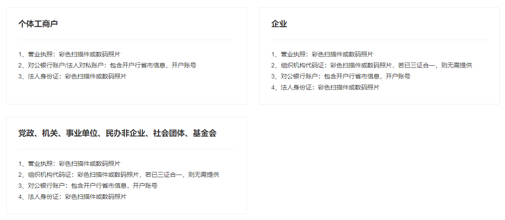
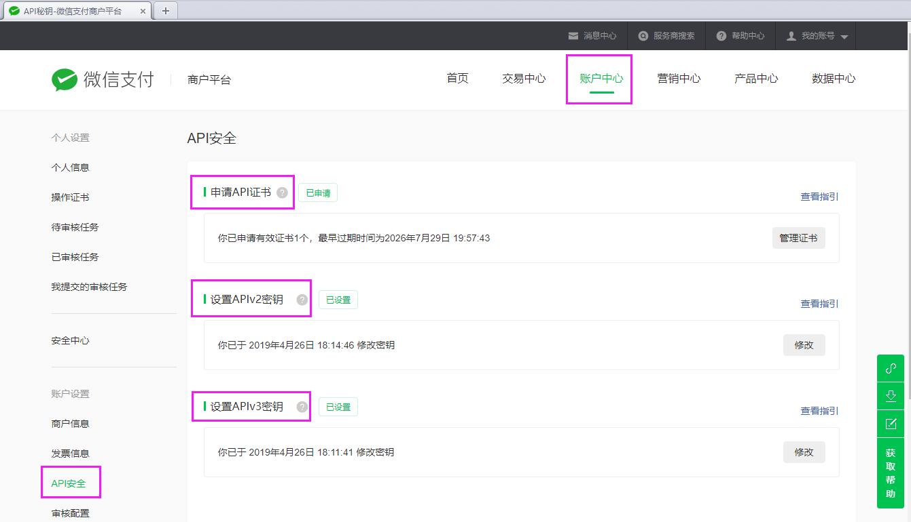
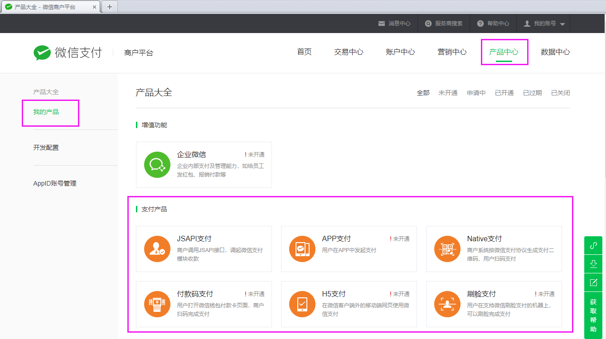
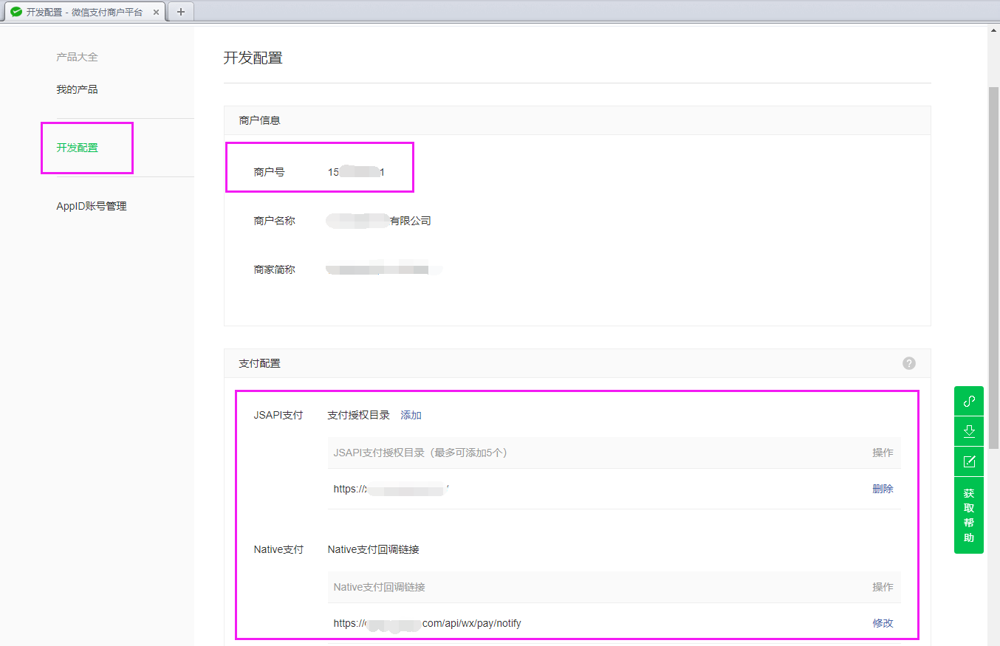
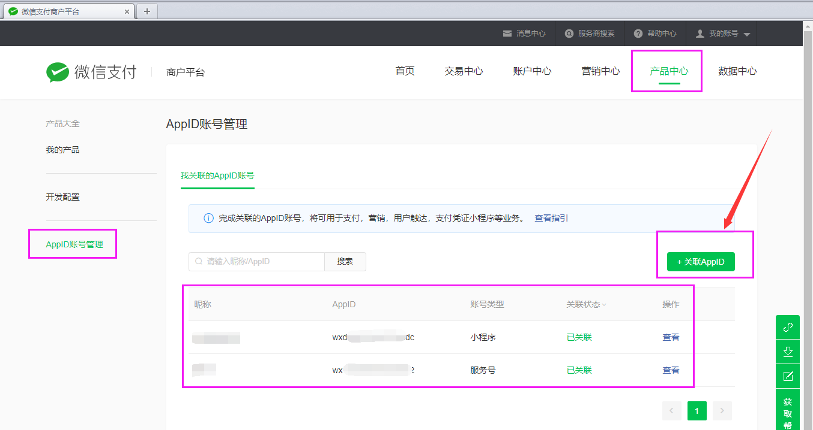
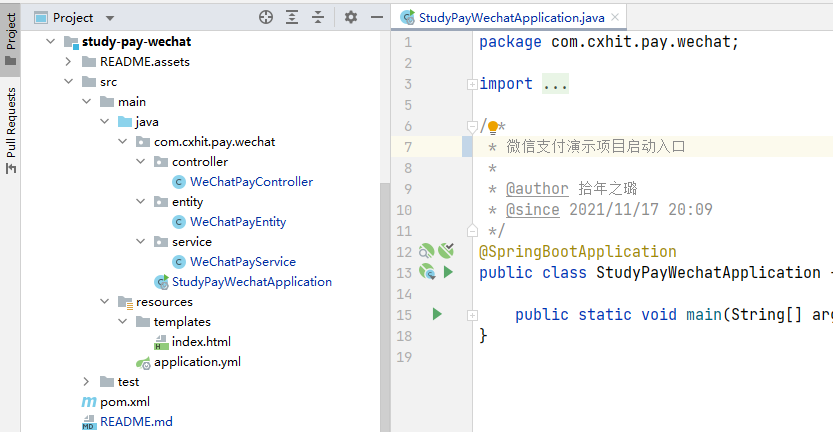
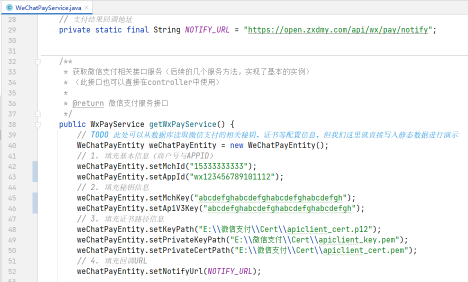
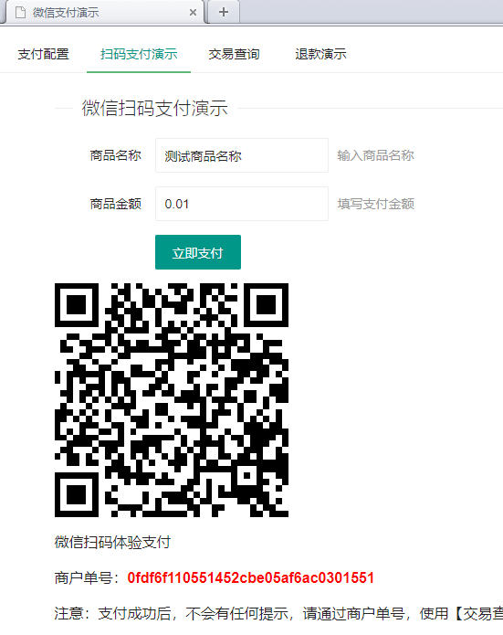

# Spring Boot组件集成实战之：集成微信支付

## 0. 项目演示

正式开始之前，请看本文项目的演示视频。

演示地址1：[https://www.bilibili.com/video/BV1cS4y1f7PP/](https://www.bilibili.com/video/BV1cS4y1f7PP/)

演示地址2：[https://live.csdn.net/v/184413](https://live.csdn.net/v/184413)

## 1. 开发环境准备

在接入`微信支付`之前，需要先在`微信支付商户平台`入驻，成为`商家`，才能继续后续的开发。

> 微信支付商户平台网址：[https://pay.weixin.qq.com](https://pay.weixin.qq.com)

不过，个人用户是无法成为`商家`的，只有以下几种用户类型才可以成为`商家`。



成为`商家`后，需要完成证书申请、秘钥配置、产品申请等操作，具体如下。

### 1.1 申请证书与秘钥配置

进入`微信支付商户平台`，在`账号中心→API安全`页面，完成`API证书`的申请，和`API秘钥`的配置，如下图所示。



`API证书`申请过程稍微复杂，但是官方有详细的申请较长，点击右侧的`查看指引`按钮，根据教程一步一步来操作即可。

两种`API秘钥`则是自定义的`32个字符`的字符串，任意填写并记住即可。

### 1.2 申请产品

进入`微信支付商户平台`，在`产品中心→我的产品`页面，可以查看当前商户`已开通`和`未开通`的`产品`，根据项目需求，自行申请开通即可。



### 1.3 开发配置信息填写

进入`微信支付商户平台`，在`产品中心→开发配置`页面，记下本商户的`商户号`，并填写已申请支付产品的各项`授权目录`、`回调链接`等信息。



### 1.4 APPID账号管理

进入`微信支付商户平台`，在`产品中心→AppID账号管理`页面，关联诸如服务号、订阅号、小程序、企业微信、移动应用、网站应用等的`APPID`，如下图所示。



至此，微信支付商户的基本信息配置完毕，总结下来，以下5项信息是必须的：

+ 商户号
+ AppID
+ API证书（3个文件）
+ APIv2秘钥
+ APIv3秘钥
+ 回调链接

## 2. 项目创建与依赖导入

### 2.1 创建Spring Boot项目

创建`Spring Boot项目`的教程太多太多了…比如：https://cxhit.blog.csdn.net/article/details/113782979，所以这里就不再赘述。

项目结构如下图所示。



### 2.2 导入依赖

在`pom.xml`文件中，引入微信支付的第三方SDK依赖：

```xml
<!-- 微信支付的核心依赖 -->
<!-- https://search.maven.org/artifact/com.github.binarywang/weixin-java-pay -->
<!-- https://github.com/Wechat-Group/WxJava -->
<dependency>
    <groupId>com.github.binarywang</groupId>
    <artifactId>weixin-java-pay</artifactId>
    <version>4.2.2.B</version>
</dependency>
```

其中最新版本可前往Maven官方仓库查看。

## 3. 实现支付服务类

### 3.1 创建配置实体类

在`com.cxhit.pay.wechat.entity`包下，新建名为`WeChatPayEntity`的`实体类`，并写入如下内容。

```java
package com.cxhit.pay.wechat.entity;

import java.io.Serializable;

/**
 * 微信支付配置信息
 *
 * @author 拾年之璐
 * @since 2022/1/13 17:20
 */
public class WeChatPayEntity implements Serializable {

    private static final long serialVersionUID = 1L;

    /**
     * 必填：微信支付商户号
     */
    private String mchId;

    /**
     * 必填：商户绑定的微信公众号、小程序、开放平台等的appid
     */
    private String appId;

    /**
     * 必填：APIv2密钥（调用v2版本的API时，需用APIv2密钥生成签名）
     */
    private String mchKey;

    /**
     * 必填：APIv3密钥（调用APIv3的下载平台证书接口、处理回调通知中报文时，要通过该密钥来解密信息）
     */
    private String apiV3Key;

    /**
     * 必填：apiclient_cert.p12证书文件的绝对路径，或者以classpath:开头的类路径。
     */
    private String keyPath;

    /**
     * 必填：apiclient_key.pem证书文件的绝对路径，或者以classpath:开头的类路径。
     */
    private String privateKeyPath;

    /**
     * 必填：apiclient_cert.pem证书文件的绝对路径，或者以classpath:开头的类路径。
     */
    private String privateCertPath;

    /**
     * 必填：微信支付异步回调通知地址。通知url必须以https开头（SSL协议），外网可访问，不能携带参数。
     */
    private String notifyUrl;
}
```

> 注意：为了减少代码篇幅，此代码引入了`lombok`。如果没有使用`lombok`，请自行生成Get和Set方法。

### 3.2 实现支付服务类

在`com.cxhit.pay.wechat.service`包下，新建名为`WeChatPayService`的服务类，并写入如下代码。

> 以下代码实现了基本的配置和支付、退款、查询功能，有详细的注释。
>
> 另注意：以下代码中使用了Hutool组件的Id生成工具（用于生成订单号），请在pom文件中自行添加hutool的依赖。

```java
package com.cxhit.pay.wechat.service;

import com.cxhit.pay.wechat.entity.WeChatPayEntity;
import com.github.binarywang.wxpay.bean.request.WxPayRefundV3Request;
import com.github.binarywang.wxpay.bean.request.WxPayUnifiedOrderV3Request;
import com.github.binarywang.wxpay.bean.result.WxPayOrderQueryV3Result;
import com.github.binarywang.wxpay.bean.result.WxPayRefundV3Result;
import com.github.binarywang.wxpay.bean.result.enums.TradeTypeEnum;
import com.github.binarywang.wxpay.config.WxPayConfig;
import com.github.binarywang.wxpay.exception.WxPayException;
import com.github.binarywang.wxpay.service.WxPayService;
import com.github.binarywang.wxpay.service.impl.WxPayServiceImpl;
import org.apache.commons.lang3.StringUtils;
import org.springframework.stereotype.Service;


/**
 * 微信支付服务类（只实现V3接口）
 *
 * @author 拾年之璐
 * @since 2022/1/13 17:32
 */
@Service
public class WeChatPayService {

    // 是否启用沙箱环境。微信支付的沙箱环境贼垃圾...好多年不维护...千万不要用。。。
    private static final Boolean SAND_BOX_ENV = false;
    // 支付结果回调地址
    private static final String NOTIFY_URL = "https://open.zxdmy.com/api/wx/pay/notify";


    /**
     * 获取微信支付相关接口服务（后续的几个服务方法，实现了基本的实例）
     * （此接口也可以直接在controller中使用）
     *
     * @return 微信支付服务接口
     */
    public WxPayService getWxPayService() {
        // TODO 此处可以从数据库读取微信支付的相关秘钥、证书等配置信息。但我们这里就直接写入静态数据进行演示
        WeChatPayEntity weChatPayEntity = new WeChatPayEntity();
        // 1. 填充基本信息（商户号与APPID）
        weChatPayEntity.setMchId("15333333333");
            weChatPayEntity.setAppId("wx123456789101112");
        // 2. 填充秘钥信息
        weChatPayEntity.setMchKey("abcdefghabcdefghabcdefghabcdefgh");
        weChatPayEntity.setApiV3Key("abcdefghabcdefghabcdefghabcdefgh");
        // 3. 填充证书路径信息
        weChatPayEntity.setKeyPath("E:\\微信支付\\Cert\\apiclient_cert.p12");
        weChatPayEntity.setPrivateKeyPath("E:\\微信支付\\Cert\\apiclient_key.pem");
        weChatPayEntity.setPrivateCertPath("E:\\微信支付\\Cert\\apiclient_cert.pem");
        // 4. 填充回调URL
        weChatPayEntity.setNotifyUrl(NOTIFY_URL);

        // 以下代码无需修改
        // 生成配置
        WxPayConfig payConfig = new WxPayConfig();
        // 填充基本配置信息
        payConfig.setAppId(StringUtils.trimToNull(weChatPayEntity.getAppId()));
        payConfig.setMchId(StringUtils.trimToNull(weChatPayEntity.getMchId()));
        payConfig.setMchKey(StringUtils.trimToNull(weChatPayEntity.getMchKey()));
        payConfig.setApiV3Key(StringUtils.trimToNull(weChatPayEntity.getApiV3Key()));
        payConfig.setKeyPath(StringUtils.trimToNull(weChatPayEntity.getKeyPath()));
        payConfig.setPrivateCertPath(StringUtils.trimToNull(weChatPayEntity.getPrivateCertPath()));
        payConfig.setPrivateKeyPath(StringUtils.trimToNull(weChatPayEntity.getPrivateKeyPath()));
        payConfig.setNotifyUrl(StringUtils.trimToNull(weChatPayEntity.getNotifyUrl()));
        // 创建配置服务
        WxPayService wxPayService = new WxPayServiceImpl();
        wxPayService.setConfig(payConfig);
        // 可以指定是否使用沙箱环境
        payConfig.setUseSandboxEnv(SAND_BOX_ENV);
        if (SAND_BOX_ENV) {
            try {
                payConfig.setMchKey(wxPayService.getSandboxSignKey());
                wxPayService.setConfig(payConfig);
            } catch (WxPayException e) {
                throw new RuntimeException(e.getMessage());
            }
        }
        // 返回结果
        return wxPayService;
    }

    /**
     * 下单接口（只设置了必填信息）（V3版本）
     *
     * @param tradeType   必填：交易类型：jsapi（含小程序）、app、h5、native
     * @param description 必填：商品描述（商品标题）
     * @param outTradeNo  必填：商家订单号
     * @param total       必填：商品金额（单位：分）
     * @param openId      特殊必填：支付用户的OpenId，JSAPI支付时必填。
     * @return 支付返回结果：{0:Y|N，1:支付结果} <br>
     * 关于支付结果： <br>
     * APP支付、JSAPI支付为[预支付交易会话标识] <br>
     * Native支付为[二维码链接] <br>
     * H5支付为[支付跳转链接]
     */
    public String[] pay(String tradeType, String description, String outTradeNo, Integer total, String openId) {
        // 构建统一下单请求参数对象
        WxPayUnifiedOrderV3Request wxPayUnifiedOrderV3Request = new WxPayUnifiedOrderV3Request();
        // 对象中写入数据
        wxPayUnifiedOrderV3Request
                // 【1】必填信息
                // 商品描述：必填
                .setDescription(description)
                // 商户订单号：必填，同一个商户号下唯一
                .setOutTradeNo(outTradeNo)
                // 通知地址：必填，公网域名必须为https，外网可访问。可不填，通过配置信息读取（但这个组件没写...）
                .setNotifyUrl(NOTIFY_URL)
                // 订单金额：单位（分）
                .setAmount(new WxPayUnifiedOrderV3Request.Amount().setTotal(total))
                // 【2】选填信息
                // 附加信息
                .setAttach("附加信息")
                // 订单优惠标记
                // ...
                .setGoodsTag("ABCD");

        try {
            // 根据请求类型，返回指定类型，其中包含：【3】条件必填信息
            switch (tradeType.toLowerCase()) {
                // Native支付
                case "native":
                    return new String[]{
                            "Y", this.getWxPayService().unifiedOrderV3(TradeTypeEnum.NATIVE, wxPayUnifiedOrderV3Request).getCodeUrl()
                    };
                // JSAPI支付
                case "jsapi":
                    // 用户在直连商户appid下的唯一标识。 下单前需获取到用户的Openid
                    wxPayUnifiedOrderV3Request.setPayer(new WxPayUnifiedOrderV3Request.Payer().setOpenid(openId));
                    return new String[]{
                            "Y", this.getWxPayService().unifiedOrderV3(TradeTypeEnum.JSAPI, wxPayUnifiedOrderV3Request).getPrepayId()
                    };
                // H5支付
                case "h5":
                    wxPayUnifiedOrderV3Request.setSceneInfo(
                            new WxPayUnifiedOrderV3Request.SceneInfo()
                                    // 用户终端IP
                                    .setPayerClientIp("12.34.56.78")
                                    .setH5Info(
                                            new WxPayUnifiedOrderV3Request.H5Info()
                                                    // 场景类型
                                                    .setType("wechat")
                                    )
                    );
                    return new String[]{
                            "Y", this.getWxPayService().unifiedOrderV3(TradeTypeEnum.H5, wxPayUnifiedOrderV3Request).getH5Url()
                    };
                // APP支付
                case "app":
                    return new String[]{
                            "Y", this.getWxPayService().unifiedOrderV3(TradeTypeEnum.APP, wxPayUnifiedOrderV3Request).getPrepayId()
                    };
                default:
                    // throw new RuntimeException("输入的[" + tradeType + "]不合法，只能为native、jsapi、h5、app其一，请核实！");
                    return new String[]{
                            "N", "输入的[" + tradeType + "]不合法，只能为native、jsapi、h5、app其一，请核实！"
                    };
            }
        } catch (WxPayException e) {
            // throw new RuntimeException(e.getMessage());
            return new String[]{
                    "N", e.getMessage()
            };
        }
    }

    /**
     * 订单查询接口（新版V3）
     *
     * @param transactionId 微信订单号
     * @param outTradeNo    商户系统内部的订单号，当没提供微信订单号（transactionId）时需要传
     * @return 订单成功（SUCCESS）：{0:Y，1:商户单号，2:微信单号，3:订单金额(分)，4:交易时间，5:交易状态，6:交易描述}
     * 订单异常：{0:N，1:订单状态，2:订单描述}
     * 查询错误：{0:E，1:错误代码，2:错误描述}
     */
    public String[] query(String transactionId, String outTradeNo) {
        // 商家单号和微信单号不能同时为空
        if (null == transactionId && null == outTradeNo) {
            return new String[]{
                    "E",
                    "ERROR",
                    "微信单号和商户单号不能同时为空，请检查！"
            };
        }
        try {
            // 执行查询并返回查询结果
            WxPayOrderQueryV3Result wxPayOrderQueryV3Result = this.getWxPayService().queryOrderV3(transactionId, outTradeNo);
            // 如果交易成功，或者在退款中
            if ("SUCCESS".equals(wxPayOrderQueryV3Result.getTradeState()) || "REFUND".equals(wxPayOrderQueryV3Result.getTradeState())) {
                return new String[]{
                        "Y",
                        wxPayOrderQueryV3Result.getOutTradeNo(),
                        wxPayOrderQueryV3Result.getTransactionId(),
                        String.valueOf(wxPayOrderQueryV3Result.getAmount().getTotal()),
                        wxPayOrderQueryV3Result.getSuccessTime(),
                        wxPayOrderQueryV3Result.getTradeState(),
                        wxPayOrderQueryV3Result.getTradeStateDesc()
                };
            } else {
                return new String[]{
                        "N",
                        wxPayOrderQueryV3Result.getTradeState(),
                        wxPayOrderQueryV3Result.getTradeStateDesc()
                };
            }
        } catch (WxPayException e) {
            // throw new RuntimeException(e.getMessage());
            return new String[]{
                    "E",
                    e.getErrCode(),
                    e.getErrCodeDes()
            };
        }
    }


    /**
     * 退款接口（新版V3）
     *
     * @param outTradeNo  商户订单号
     * @param outRefundNo 商户退款单号
     * @param total       订单总金额（单位：分）
     * @param refund      退款金额（单位：分）
     * @return 退款成功或退款处理中：{0:Y，1:商户单号，2:微信单号，3:退款单号，4:订单金额(分)，5:退款金额（分），6:退款时间}<br>
     * 订单异常：{0:N，1:订单状态，2:订单描述}
     * 退款错误：{0:E，1:错误代码，2:错误描述}
     */
    public String[] refund(String outTradeNo, String outRefundNo, Integer total, Integer refund) {
        // 几个参数不能为空
        if (null == outTradeNo || null == outRefundNo || null == total || null == refund) {
            return new String[]{
                    "E",
                    "ERROR",
                    "商户单号、退款单号、订单金额、退款金额均不能为空，请检查！"
            };
        }
        // 构造请求参数
        WxPayRefundV3Request wxPayRefundV3Request = new WxPayRefundV3Request();
        wxPayRefundV3Request
                .setOutTradeNo(outTradeNo)
                .setOutRefundNo(outRefundNo)
                .setAmount(new WxPayRefundV3Request.Amount()
                        .setTotal(total)
                        .setRefund(refund)
                        .setCurrency("CNY")
                );
        try {
            // 执行请求并返回信息
            WxPayRefundV3Result wxPayRefundV3Result = this.getWxPayService().refundV3(wxPayRefundV3Request);
            // 退款处理中 || 退款成功
            if ("PROCESSING".equals(wxPayRefundV3Result.getStatus()) || "SUCCESS".equals(wxPayRefundV3Result.getStatus())) {
                return new String[]{
                        "Y",
                        wxPayRefundV3Result.getOutTradeNo(),
                        wxPayRefundV3Result.getTransactionId(),
                        wxPayRefundV3Result.getOutRefundNo(),
                        String.valueOf(wxPayRefundV3Result.getAmount().getTotal()),
                        String.valueOf(wxPayRefundV3Result.getAmount().getRefund()),
                        wxPayRefundV3Result.getCreateTime()
                };
            } else {
                return new String[]{
                        "N",
                        wxPayRefundV3Result.getStatus(),
                        "退款失败"
                };
            }

        } catch (WxPayException e) {
            // throw new RuntimeException(e.getMessage());
            return new String[]{
                    "E",
                    e.getErrCode(),
                    e.getErrCodeDes()
            };
        }
    }
}
```

### 3.3 服务类的补充说明
一般来说，我们将`配置信息`放在`yaml`文件中。这种操作是没有问题的。

但本文中的`支付服务类`的实现方案，可以实现将微信支付的`配置信息`，经过`加密`后，存储在`数据库`中。

当需要发起支付的时候，从`数据库`中读取信息后，经过`解密`，再写入到微信的`支付配置类`中。

对于本演示项目，其配置信息就直接写在代码里了，如下图所示。


**另外：**

为了方便，本`支付服务类`的返回结果，直接通过`数组`形式返回。实际项目中，建议通过`bean实体`的形式返回。

或者直接在`控制类`中调用`getWxPayService()`方法，在控制类中实现支付、查询、退款等功能。

> 整个服务类放在控制类中也没有问题。

## 4. 控制类调用与前端展示

### 4.1 实现控制类

在`com.cxhit.pay.wechat.controller`包中，新建`WeChatPayController`控制类，并实现如下代码。

> 代码有详细注释，不过多解释。

```java
package com.cxhit.pay.wechat.controller;

import cn.hutool.core.lang.Dict;
import cn.hutool.core.util.IdUtil;
import com.cxhit.pay.wechat.service.WeChatPayService;
import org.springframework.beans.factory.annotation.Autowired;
import org.springframework.stereotype.Controller;
import org.springframework.web.bind.annotation.GetMapping;
import org.springframework.web.bind.annotation.PostMapping;
import org.springframework.web.bind.annotation.RequestMapping;
import org.springframework.web.bind.annotation.ResponseBody;

/**
 * 微信支付控制类
 *
 * @author 拾年之璐
 * @since 2022/1/13 18:04
 */
@Controller
@RequestMapping("")
public class WeChatPayController {

    @Autowired
    private WeChatPayService weChatPayService;

    /**
     * 首页
     *
     * @return 首页
     */
    @GetMapping("")
    public String index() {
        return "index";
    }

    /**
     * 微信支付接口
     *
     * @param title 商品名称
     * @param price 商品价格
     * @return 返回结果
     */
    @PostMapping(value = "/pay")
    @ResponseBody
    public Dict pay(String title, String price) {
        // 生成商家单号
        String outTradeNo = IdUtil.simpleUUID();
        // 支付宝价格转换成浮点数后，乘100，再取整，得以分为单位的价格
        Integer total = (int) (Float.parseFloat(price) * 100);
        // 发起支付请求
        String[] result = weChatPayService.pay("native", title, outTradeNo, total, null);
        // 返回结果：下单成功
        if ("Y".equals(result[0])) {
            return Dict.create().set("code", 200).set("qrcode", result[1]).set("outTradeNo", outTradeNo);
        }
        // 下单失败
        else {
            return Dict.create().set("code", 500).set("msg", result[1]);
        }
    }

    /**
     * 退款接口
     *
     * @param outTradeNo 商家单号
     * @param amount     退款金额（不能大于总金额）
     * @return 退款结果
     */
    @PostMapping(value = "/refund")
    @ResponseBody
    public Dict refund(String outTradeNo, String amount) {
        // 生成商家退款单号
        String outRefundNo = IdUtil.simpleUUID();
        // 查询订单金额
        String[] query = weChatPayService.query(null, outTradeNo);
        // 查询成功
        if (query[0].equals("Y")) {
            int total = Integer.parseInt(query[3]);
            // 支付宝价格转换成浮点数后，乘100，再取整，得以分为单位的价格
            int refund = (int) (Float.parseFloat(amount) * 100);
            if (refund > total) {
                return Dict.create().set("code", 500).set("msg", "退款错误：退款金额不能大于支付金额！");
            }
            // 发起退款
            String[] result = weChatPayService.refund(outTradeNo, outRefundNo, total, refund);
            // 退款成功
            if (result[0].equals("Y")) {
                return Dict.create().set("code", 200).set("msg", "退款进行中，稍后到账！" +
                        " <br>商户单号：" + result[1] +
                        " <br>退款单号：" + result[3] +
                        " <br>订单金额：" + result[4] + "分" +
                        " <br>退款金额：" + result[5] + "分" +
                        " <br>退款时间：" + result[6]
                );
            }
            // 退款失败
            else if (result[0].equals("N")) {
                return Dict.create().set("code", 500).set("msg", "退款失败：" + result[1] + result[2]);
            }
            // 退款发生错误
            else {
                return Dict.create().set("code", 500).set("msg", "退款错误：" + result[1] + result[2]);
            }
        }
        // 查询失败
        else {
            return Dict.create().set("code", 500).set("msg", "退款错误：" + query[1] + query[2]);
        }
    }

    /**
     * 查询接口
     *
     * @param outTradeNo 商家订单号
     * @return 结果
     */
    @PostMapping(value = "/query")
    @ResponseBody
    public Dict query(String outTradeNo) {
        // 查询订单
        String[] query = weChatPayService.query(null, outTradeNo);
        // 查询成功
        if (query[0].equals("Y")) {
            return Dict.create().set("code", 200).set("msg", "查询成功！" +
                    " <br>商户单号：" + query[1] +
                    " <br>微信单号：" + query[2] +
                    " <br>订单金额：" + query[3] + "分" +
                    " <br>交易时间：" + query[4] +
                    " <br>交易状态：" + query[5] +
                    " <br>交易描述：" + query[6]
            );
        }
        // 查询失败
        else if (query[0].equals("N")) {
            return Dict.create().set("code", 500).set("msg", "查询结果：" + query[1] + query[2]);
        }
        // 查询发送异常
        else {
            return Dict.create().set("code", 500).set("msg", "查询失败：" + query[1] + query[2]);
        }
    }
}
```

### 4.2 实现前端展示

前端代码较长，请看项目源码。

最终实现的前端展示页面如下图所示。



至此，Spring Boot集成微信支付项目结束。

