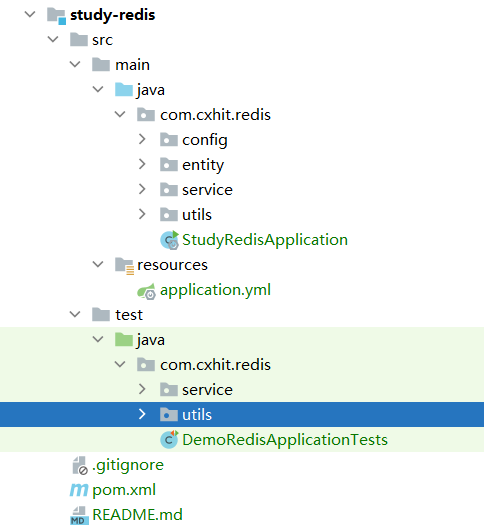
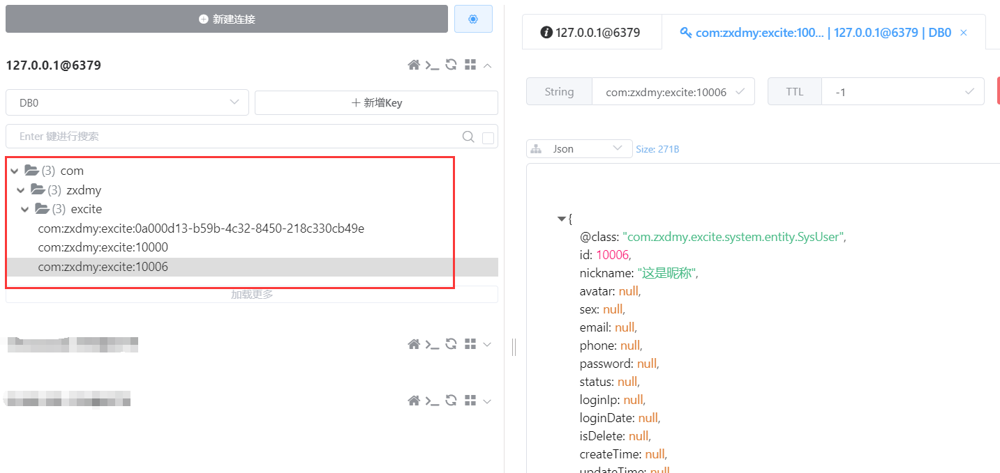
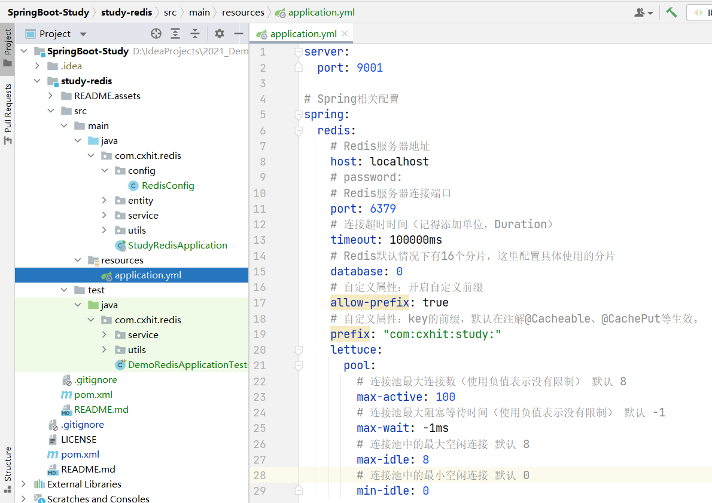
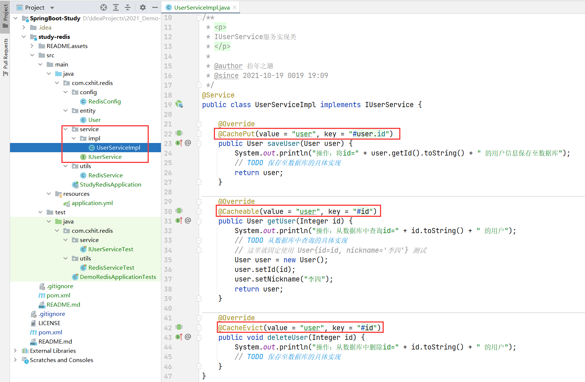
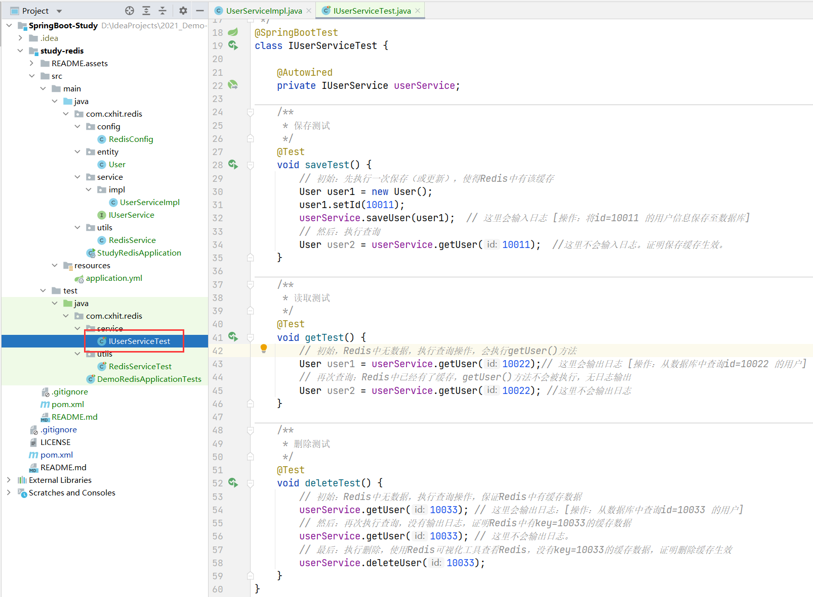
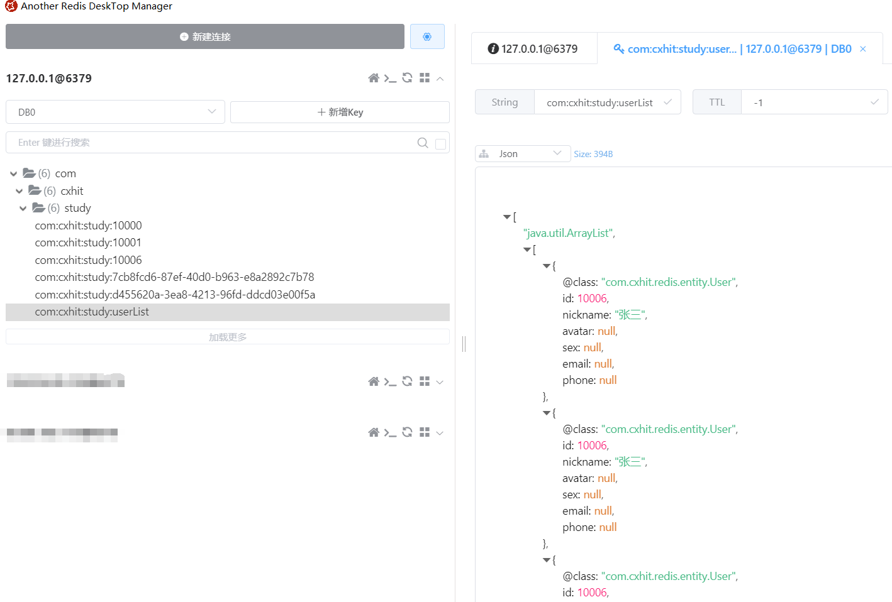

# Spring Boot组件集成专栏之：集成Redis数据库

## 1. Redis的产生原因

一个技术的出现，必然有它的道理。

大数据时代的当前，每天都在处理`海量`、`多样`的数据，而且这些数据，需要`实时`处理。互联网应用必须保证`高并发`、`高可用`、`高性能`，才能满足这些需求。

我们都知道，CPU的运行速度比内存快一百多倍，比硬盘快几百万倍。

传统的关系型数据库，如MySQL，其将数据保存至硬盘。而高并发场景下，限制数据库性能的瓶颈，主要在于硬盘。

所以，在某些需要存储大量Web应用数据，并且需要对这些应用数据进行高并发的读写的场景下，关系型数据集并不能满足我们的需求。

在这样的背景下，Redis产生了。

>   感兴趣的可以去检索一下`Redis的诞生历程`。

## 2. Redis解决的问题

Redis是一个高性能的`分布式内存数据库`，基于内存运行并支持持久化的NoSQL数据库，是当前热门的NoSQL数据库之一。其主要有三个特点：

+   支持数据持久化，可以将内存中的数据保存到磁盘中，重启的时候可以再次加载进行使用；
+   不仅仅支持简单的`key-value型数据`，同时还提供list、set、hash等数据结构的存储；
+   支持数据备份，master-slave模式的数据备份。

## 3. Spring Boot集成Redis

### 3.1 创建项目与引入依赖

1、新建一个`Spring Boot项目`。我们创建的项目结构如下：



>   这里注意包结构，后文中创建的类文件，将直接写包路径！

2、在 `pom.xml` 文件中引入 `spring-boot-starter-data-redis` 依赖，这是Redis的核心依赖。

同时还需要引入`pool2` 依赖。

```xml
<!-- Redis -->
<!-- https://mvnrepository.com/artifact/org.springframework.boot/spring-boot-starter-data-redis -->
<dependency>
    <groupId>org.springframework.boot</groupId>
    <artifactId>spring-boot-starter-data-redis</artifactId>
    <!-- Spring Boot内有默认版本，可以省略此项 -->
    <!-- <version>2.5.5</version> -->
</dependency>
<!-- 对象池，使用redis时，最好引入 -->
<!-- 使用对象池，每次创建的对象并不实际销毁，而是缓存在对象池中，下次使用的时候，不用再重新创建，直接从对象池的缓存中取即可-->
<dependency>
    <groupId>org.apache.commons</groupId>
    <artifactId>commons-pool2</artifactId>
</dependency>
```

### 3.2 配置Redis配置类

3、在 `com.cxhit.redis.config` 包下，新建名为 `RedisConfig` 的配置类，并写入如下信息。

```java
package com.cxhit.redis.config;

import org.springframework.boot.autoconfigure.AutoConfigureAfter;
import org.springframework.boot.autoconfigure.data.redis.RedisAutoConfiguration;
import org.springframework.boot.context.properties.ConfigurationProperties;
import org.springframework.cache.CacheManager;
import org.springframework.cache.annotation.EnableCaching;
import org.springframework.context.annotation.Bean;
import org.springframework.context.annotation.Configuration;
import org.springframework.data.redis.cache.RedisCacheConfiguration;
import org.springframework.data.redis.cache.RedisCacheManager;
import org.springframework.data.redis.connection.RedisConnectionFactory;
import org.springframework.data.redis.connection.lettuce.LettuceConnectionFactory;
import org.springframework.data.redis.core.RedisTemplate;
import org.springframework.data.redis.serializer.GenericJackson2JsonRedisSerializer;
import org.springframework.data.redis.serializer.RedisSerializationContext;
import org.springframework.data.redis.serializer.StringRedisSerializer;
import org.springframework.stereotype.Component;

import java.io.Serializable;

/**
 * <p>
 * Redis 的相关配置
 * </p>
 *
 * @author 拾年之璐
 * @since 2021-10-19 0019 17:22
 */
@Component
@Configuration
@EnableCaching
@AutoConfigureAfter(RedisAutoConfiguration.class)
@ConfigurationProperties(prefix = "spring.redis")
public class RedisConfig {
    /**
     * 自定义属性：Redis key 的前缀
     */
    private String prefix = "redis:prefix:";

    /**
     * 自定义属性：是否开启Redis自定义前缀，默认关闭。
     */
    private Boolean allowPrefix = false;

    /**
     * 默认情况下的模板只能支持RedisTemplate<String, String>，也就是只能存入字符串，因此支持序列化
     */
    @Bean
    public RedisTemplate<String, Serializable> redisCacheTemplate(LettuceConnectionFactory redisConnectionFactory) {
        RedisTemplate<String, Serializable> template = new RedisTemplate<>();
        // key采用String的序列化方式
        template.setKeySerializer(new StringRedisSerializer());
        // hash的key也采用String的序列化方式
        template.setHashKeySerializer(new StringRedisSerializer());
        // value序列化方式采用jackson
        template.setValueSerializer(new GenericJackson2JsonRedisSerializer());
        // hash的value序列化方式采用jackson
        template.setHashValueSerializer(new GenericJackson2JsonRedisSerializer());
        template.setConnectionFactory(redisConnectionFactory);
        return template;
    }

    /**
     * 配置使用注解的时候缓存配置，默认是序列化反序列化的形式，加上此配置则为 json 形式
     */
    @Bean
    public CacheManager cacheManager(RedisConnectionFactory factory) {
        // 配置序列化
        RedisCacheConfiguration config = RedisCacheConfiguration.defaultCacheConfig();
        RedisCacheConfiguration redisCacheConfiguration = config
                // 覆盖默认的构造key，否则会多出一个冒号
                .computePrefixWith(cacheName -> this.allowPrefix ? this.prefix + cacheName + ":" : cacheName)
                .serializeKeysWith(RedisSerializationContext.SerializationPair.fromSerializer(new StringRedisSerializer()))
                .serializeValuesWith(RedisSerializationContext.SerializationPair.fromSerializer(new GenericJackson2JsonRedisSerializer()))
                // 不缓存空值
                // .disableCachingNullValues()
                ;

        return RedisCacheManager.builder(factory).cacheDefaults(redisCacheConfiguration).build();
    }


    public String getPrefix() {
        return prefix;
    }

    public void setPrefix(String prefix) {
        this.prefix = prefix;
    }

    public Boolean getAllowPrefix() {
        return allowPrefix;
    }

    public void setAllowPrefix(Boolean allowPrefix) {
        this.allowPrefix = allowPrefix;
    }
}
```

关于两个`@Bean`处的配置信息，通过阅读注释即可了解详情。

此处我们自定义了两个配置属性，其功能均在注释中。

通过添加前缀，可以保证本项目的`key`在Redis数据库中是唯一的，不会与其他项目造成冲突。

此外，我们这里自定义了`前缀`属性`prefix`，使用`英文冒号`间隔。这样在某些Redis可视化工具下，缓存数据以树形结构（层级结构）显示数据。如下图所示。



### 3.3 配置application.yml

4、在`application.yml`配置文件中，配置`Redis`的相关信息，如下图所示。



详细配置代码如下。

```yaml
# Spring相关配置
spring:
  redis:
    # Redis服务器地址
    host: localhost
    # password:
    # Redis服务器连接端口
    port: 6379
    # 连接超时时间（记得添加单位，Duration）
    timeout: 100000ms
    # Redis默认情况下有16个分片，这里配置具体使用的分片
    database: 0
    # 自定义属性：开启自定义前缀
    allow-prefix: true
    # 自定义属性：key的前缀，默认在注解@Cacheable、@CachePut等生效。
    prefix: "com:cxhit:study:"
    lettuce:
      pool:
        # 连接池最大连接数（使用负值表示没有限制） 默认 8
        max-active: 100
        # 连接池最大阻塞等待时间（使用负值表示没有限制） 默认 -1
        max-wait: -1ms
        # 连接池中的最大空闲连接 默认 8
        max-idle: 8
        # 连接池中的最小空闲连接 默认 0
        min-idle: 0
```

### 3.4 配置Redis工具类

通过配置`Redis工具类`，可以方便我们在其他类中使用Redis。

当然此工具类可以根据自己的项目需求，进行修改和调整。

在 `com.cxhit.redis.utils` 包下，新建名为 `RedisService` 的`java class`，并写入如下配置信息。

```java
package com.cxhit.redis.utils;

import com.cxhit.redis.config.RedisConfig;
import org.springframework.beans.factory.annotation.Autowired;
import org.springframework.data.redis.core.RedisTemplate;
import org.springframework.stereotype.Service;

import java.io.Serializable;
import java.util.UUID;
import java.util.concurrent.TimeUnit;

/**
 * <p>
 * Redis工具服务类
 * </p>
 *
 * @author 拾年之璐
 * @since 2021-10-19 0019 17:23
 */
@Service
public class RedisService {

    @Autowired
    private RedisTemplate<String, Serializable> redisTemplate;

    @Autowired
    private RedisConfig redisConfig;

    /**
     * 写入普通缓存，key由系统生成
     *
     * @param value 值
     * @return 键
     */
    public String set(Serializable value) {
        // 随机生成key
        String key = UUID.randomUUID().toString();
        // 如果当前生成的key已经存在，重新生成
        if (hasKey(key)) {
            return set(value);
        } else {
            // 写入缓存
            redisTemplate.opsForValue().set(redisConfig.getAllowPrefix() ? redisConfig.getPrefix() + key : key, value);
            // 返回key
            return key;
        }
    }

    /**
     * 写入带过期时间的缓存，其中key由系统生成
     *
     * @param value      值
     * @param expireTime 过期时间
     * @return 键key
     */
    public String set(Serializable value, Long expireTime) {
        // 随机生成key
        String key = UUID.randomUUID().toString();
        // 如果当前随机生成的key已经存在，则重新生成
        if (hasKey(key)) {
            return set(value, expireTime);
        } else {
            // 写入缓存
            redisTemplate.opsForValue().set(redisConfig.getAllowPrefix() ? redisConfig.getPrefix() + key : key, value, expireTime, TimeUnit.SECONDS);
            // 返回key
            return key;
        }
    }

    /**
     * 写入普通缓存，指定key
     *
     * @param key   键
     * @param value 值
     * @return 结果
     */
    public boolean set(String key, Serializable value) {
        boolean result = false;
        try {
            redisTemplate.opsForValue().set(redisConfig.getAllowPrefix() ? redisConfig.getPrefix() + key : key, value);
            result = true;
        } catch (Exception e) {
            e.printStackTrace();
        }
        return result;
    }

    /**
     * 写入带过期时间的缓存，指定key
     *
     * @param key        键
     * @param value      值
     * @param expireTime 过期时间
     * @return 结果
     */
    public boolean set(String key, Serializable value, Long expireTime) {
        boolean result = false;
        try {
            redisTemplate.opsForValue().set(redisConfig.getAllowPrefix() ? redisConfig.getPrefix() + key : key, value, expireTime, TimeUnit.SECONDS);
            result = true;
        } catch (Exception e) {
            e.printStackTrace();
        }
        return result;
    }

    /**
     * 判断某个键是否存在
     *
     * @param key 键
     * @return 存在与否
     */
    public boolean hasKey(String key) {
        return Boolean.TRUE.equals(redisTemplate.hasKey(redisConfig.getAllowPrefix() ? redisConfig.getPrefix() + key : key));
    }

    /**
     * 通过键获取值
     *
     * @param key 缓存的键
     * @return 存在：值 | 不存在：null
     */
    public Serializable get(String key) {
        if (hasKey(key)) {
            return redisTemplate.opsForValue().get(redisConfig.getAllowPrefix() ? redisConfig.getPrefix() + key : key);
        }
        return null;
    }

    /**
     * 获取某个键值的过期时间
     *
     * @param key 键
     * @return 过期时间（秒），-1表示永久有效，-2表示不存在
     */
    public Long getExpire(String key) {
        return redisTemplate.getExpire(redisConfig.getAllowPrefix() ? redisConfig.getPrefix() + key : key, TimeUnit.SECONDS);
    }

    /**
     * 通过键移出某个值
     *
     * @param key 键
     */
    public void remove(String key) {
        if (hasKey(key)) {
            redisTemplate.delete(redisConfig.getAllowPrefix() ? redisConfig.getPrefix() + key : key);
        }
    }

    /**
     * 通过键移出某些值
     *
     * @param keys 批量的键，示例：remove("001","002","003")
     */
    public void remove(String... keys) {
        for (String key : keys) {
            remove(redisConfig.getAllowPrefix() ? redisConfig.getPrefix() + key : key);
        }

    }
}
```

至此，在`Spring Boot中集成Redis数据库`完毕。

### 3.5 测试Redis

关于Redis的测试，分两个部分。

一个部分是对注解`@CachePut`、`@Cacheable`、`@CacheEvict`的测试。这三个注解，通常使用在服务层接口的实现类中，如下图所示。



这三个注解的功能描述如下。

+   @CachePut：将方法返回的结果保存至缓存。
+   @Cacheable：从缓存中根据key值查询数据。如果找到，则不执行方法，直接返回结果。如果未找到，则执行方法。
+   @CacheEvict：从缓存中删除数据。

其测试方法如下图所示。



另一部分是对工具类RedisService的测试。

其测试方法如下所示。其执行结果均在代码注释中有标注。

```java
package com.cxhit.redis.utils;

import com.cxhit.redis.entity.User;
import org.junit.jupiter.api.Test;
import org.springframework.beans.factory.annotation.Autowired;
import org.springframework.boot.test.context.SpringBootTest;

import java.io.Serializable;
import java.util.ArrayList;
import java.util.List;
import java.util.UUID;

/**
 * <p>
 * redis测试
 * </p>
 *
 * @author 拾年之璐
 * @since 2021-10-19 0019 17:28
 */
@SpringBootTest
class RedisServiceTest {

    @Autowired
    private RedisService redisService;

    @Test
    void redisTest01() {
        // 写入Redis测试：随机key，永久的值
        redisService.set(UUID.randomUUID().toString(), UUID.randomUUID());
        // 写入redis测试：随机key，带过期时间
        redisService.set(UUID.randomUUID().toString(), UUID.randomUUID(), 100L);

        // 写入Redis测试：指定key，永久的值
        redisService.set("10000", "这个值是永久的");
        // 写入Redis测试：指定key，有过期时间
        redisService.set("10001", "这个值是有过期时间的，过期时间120S", 120L);

        // 读取redis测试：获取存在的值
        String name = (String) redisService.get("10000");
        System.out.println(name);  // 输出：这个值是永久的
        // 读取redis测试：获取不存在的值
        String name2 = (String) redisService.get("abcdefg");
        System.out.println(name2);  //输出：null

        // 获取过期时间测试：永久的值
        Long time = redisService.getExpire("10000");
        System.out.println(time);  // 输出：-1
        // 获取过期时间测试：定时
        Long time2 = redisService.getExpire("10001");
        System.out.println(time2); // 输出：（一个正数）
        // 获取过期时间测试：不存在
        Long time3 = redisService.getExpire("534564564564");
        System.out.println(time3); // 输出：-2

        // key值存在测试
        if (redisService.hasKey("10001")) {
            System.out.println("key为10001的缓存存在");
        }
        // key值不存在测试
        if (redisService.hasKey("11111")) {
            System.out.println("key为11111的缓存存在");
        } else {
            System.out.println("key为11111的缓存不存在");  // 输出：11111不存在
        }

        // 写入实体测试
        User user = new User();
        user.setId(10006);
        user.setNickname("张三");
        redisService.set("10006", user);
        // 获取实体测试
        User userGet = (User) redisService.get("10006");
        System.out.println(userGet.getNickname()); // 输出：张三

        // 写入列表测试
        List<User> userList = new ArrayList<>();
        // 重复写入3条记录
        userList.add(user);
        userList.add(user);
        userList.add(user);
        redisService.set("userList", (Serializable) userList);

        // 读取列表测试
        List<User> userListGet = (List<User>) redisService.get("userList");
        for (User user1 : userListGet) {
            System.out.println(user1);
        }
    }
}
```

执行完成此测试类后，可以通过Redis可视化工具，查看缓存数据，如下图所示。



## 4. 本文源码下载

GitHub下载：


Gitee下载：


## 参考资料

+   https://blog.csdn.net/jsty181818/article/details/103646047
+   https://www.cnblogs.com/iceblow/p/11421547.html